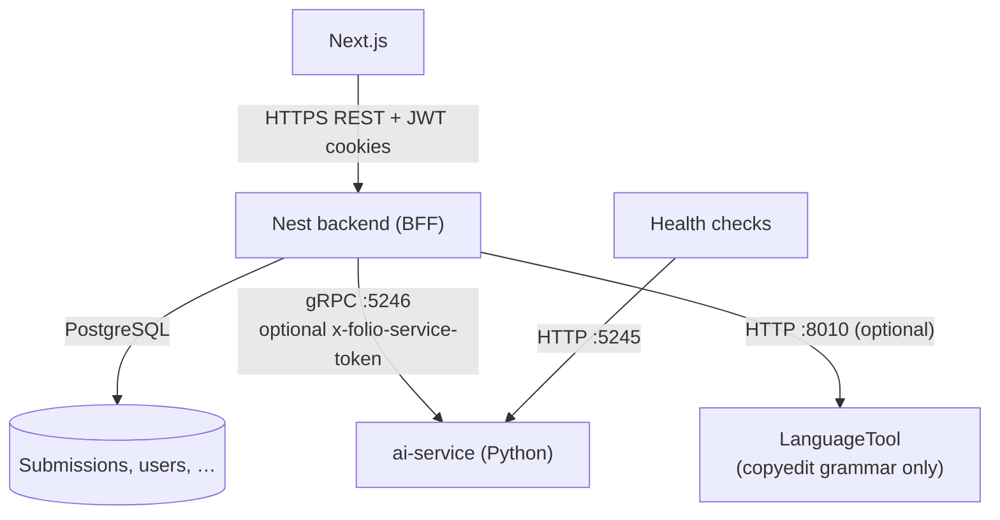
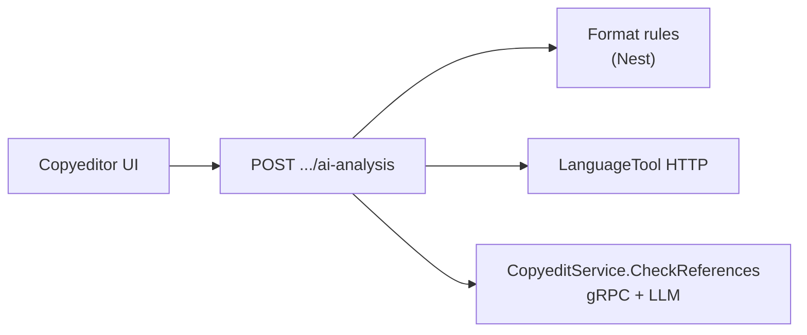

# Folio AI features — detailed guide

This document explains **how each AI-related product feature works** end to end: who triggers it, which services run, what data flows where, and how failures are handled.

For architecture flags and ports, see [`plans/ai-service.md`](./plans/ai-service.md). For Mermaid block diagrams, see [`diagrams/blocks/ai/`](./diagrams/blocks/ai/). For operator setup, see [`services/ai-service/README.md`](../services/ai-service/README.md).

---

## Table of contents

1. [Shared platform](#1-shared-platform)
2. [Arabic discipline classifier (AraBERT)](#2-arabic-discipline-classifier-arabert)
3. [Keyword suggestions (LLM)](#3-keyword-suggestions-llm)
4. [Published-article vector index (Chroma)](#4-published-article-vector-index-chroma)
5. [Related published articles](#5-related-published-articles)
6. [Public semantic catalog search](#6-public-semantic-catalog-search)
7. [Corpus similarity report (editor / reviewer)](#7-corpus-similarity-report-editor--reviewer)
8. [Suggested reviewers (editor)](#8-suggested-reviewers-editor)
9. [Copyedit analysis panel](#9-copyedit-analysis-panel)
10. [Configuration matrix](#10-configuration-matrix)
11. [Security and observability](#11-security-and-observability)

---

## 1. Shared platform

Folio splits AI work across three tiers. The browser **never** calls `ai-service` directly.

| Layer | Role |
|-------|------|
| **Next.js** | UI buttons and panels call Nest REST routes only. |
| **Nest (`AiClientService`)** | Feature flags, auth, throttling, manuscript extraction, DB persistence, aggregation of AI results. |
| **ai-service** | gRPC microservice: ML models, embeddings, Chroma, OpenAI-compatible LLM calls. |
| **LanguageTool** | Self-hosted grammar/spelling; Nest calls it over HTTP. **Not** part of ai-service. |

### gRPC contracts

All product RPCs are defined under [`proto/folio/ai/v1/`](../proto/folio/ai/v1/). Regenerate stubs after changes: `npm run proto:gen` from the repo root.

| Proto service | Primary RPCs |
|---------------|--------------|
| `ClassifierService` | `ClassifyArticle`, `ClassifyAbstract`, status/labels |
| `KeywordService` | `SuggestKeywords` |
| `SimilarityService` | `UpsertArticle`, `FindSimilarArticles`, `SemanticSearch` |
| `PlagiarismService` | `DetectCorpusSimilarity` |
| `ReviewerMatchingService` | `SuggestReviewers` |
| `CopyeditService` | `CheckReferences` |

### Nest client behavior

`backend/src/ai/ai-client.service.ts` wraps each gRPC call with:

- **Deadline** — `AI_SERVICE_TIMEOUT_MS` (default 120s).
- **Metadata** — `x-folio-service-token` when `AI_SERVICE_TOKEN` is set on both Nest and ai-service.
- **Soft failure** — Most calls return `null`, `[]`, or `{ status: 'unavailable' }` on `UNAVAILABLE` / `FAILED_PRECONDITION` instead of throwing, so the API can degrade gracefully.
- **Log redaction** — gRPC error messages pass through `ai-log-redaction.ts` so manuscript text is not logged verbatim.

### When is ai-service “on”?

Nest considers the base client enabled when **`AI_SERVICE_ENABLED=true`** and **`AI_SERVICE_GRPC_HOST`** is non-empty (typically `127.0.0.1`). Each feature has an additional flag (see [§10](#10-configuration-matrix)).

---

## 2. Arabic discipline classifier (AraBERT)

### Purpose

Suggest one of **10 Arabic discipline labels** for a submission from its title, keywords, and abstract. The author can accept or override the suggestion; editors see scope warnings when the journal restricts allowed disciplines.

### Labels

Fixed set (must match model `id2label` and `backend/src/ai/discipline-labels.ts`):

- الآداب والعلوم الإنسانية  
- الدراسات التاريخية  
- العلوم الأساسية  
- العلوم الاقتصادية والسياسية  
- العلوم التربوية والنفسية  
- العلوم الزراعية  
- العلوم الطبية  
- العلوم القانونية  
- العلوم الهندسية  
- غير محدد (unspecified)

`JOURNAL_ALLOWED_DISCIPLINES` (pipe-separated in backend `.env`) optionally limits which labels count as “in scope” for warnings—not for model inference.

### Model and inference (ai-service)

| Item | Detail |
|------|--------|
| Model | Fine-tuned `BertForSequenceClassification` on AraBERT (`aubmindlab/bert-base-arabertv02` preprocessor) |
| Code | `services/ai-service/app/ml/arabic_classifier.py`, orchestrated by `ClassifierService` |
| Input | Title, keywords, and abstract are preprocessed with `ArabertPreprocessor`, joined with `[SEP]`, truncated to 512 tokens |
| Output | Softmax over labels → **percentages 0–100** per class; top label and confidence returned |
| Hardware | CUDA if available, else CPU; weights can unload after idle timeout (`ARABERT_IDLE_TIMEOUT_SECONDS`) |
| Enable | `ARABERT_ENABLED=true` + `pip install -e ".[ml]"` + weights on disk (`ARABERT_MODEL_PATH` or default under ai-service) |

### Text selection (Nest)

`resolveClassifyText()` prefers **Arabic** metadata when present, else English:

- `title` ← `titleAr ?? title`  
- `keywords` ← `keywordsAr ?? keywords`  
- `abstract` ← `abstractAr ?? abstract`  

Abstract must be non-empty for classification.

### User-facing flows

| Trigger | REST | Behavior |
|---------|------|----------|
| Author clicks “Suggest discipline” (draft / revisions) | `POST /submissions/:slug/suggest-discipline` | Calls gRPC `ClassifyArticle`, saves `disciplineSuggested`, `disciplineSuggestedConfidence`, `disciplineClassification` JSON on the submission |
| Author submits manuscript | (submit handler) | Best-effort `refreshDisciplineSuggestion()`; failure is logged, submit continues |
| Author confirms discipline | `PATCH /submissions/:slug/discipline` | Human choice; no AI call |
| Label list for UI | `GET /submissions/discipline-labels` | Static list + journal scope from env |

Frontend: `submission-discipline-panel.tsx`.

### Persistence

On success, Nest stores:

- `disciplineSuggested` — top Arabic label string  
- `disciplineSuggestedConfidence` — stringified number (0–100)  
- `disciplineClassification` — JSON: full `probabilities`, `classifiedAt`, `scopeInJournal`, `scopeWarning`  

The author’s confirmed `discipline` field is separate (`disciplineSource` tracks manual vs suggested).

### Errors

| Condition | API |
|-----------|-----|
| AI off or gRPC down | `AI_SERVICE_UNAVAILABLE` on explicit suggest; submit skips silently |
| Empty abstract | `VALIDATION_ERROR` |
| Classify returns null | `AI_CLASSIFICATION_FAILED` |

---

## 3. Keyword suggestions (LLM)

### Purpose

Help authors pick **3–6 indexing-style keywords** per language (English and/or Arabic) from title + abstract. Suggestions are **not persisted** automatically—the author edits chips in the UI and must satisfy submit validation (3–6 per language when that language is used).

### Model (ai-service)

| Item | Detail |
|------|--------|
| Provider | `AI_PROVIDER=openai` with real `OPENAI_API_KEY` |
| Client | `OpenAiCompatProvider` — supports OpenAI API or **OpenAI-compatible gateways** (e.g. LM Studio at `OPENAI_BASE_URL=http://localhost:1234/v1`) |
| Model id | `OPENAI_MODEL` (e.g. fine-tuned Qwen 2.5 7B locally, or `gpt-4o-mini` in cloud) |
| Prompt | System prompt asks for JSON: `{ "keywords_en": [...], "keywords_ar": [...] }` |
| Post-processing | Dedupe, max 6 terms, max 80 chars per term; empty bucket if that language pair was not provided |

Enable: `KEYWORDS_SUGGESTION_ENABLED=true` on ai-service and `AI_KEYWORDS_ENABLED=true` on Nest.

### User-facing flows

| Trigger | REST | Body |
|---------|------|------|
| Existing draft | `POST /submissions/:slug/suggest-keywords` | Reads title/abstract (EN and/or AR) from submission |
| New-submission wizard (no slug yet) | `POST /submissions/suggest-keywords-preview` | Title/abstract fields in JSON body |

Requires draft or `REVISIONS_REQUESTED` status and author ownership.

### Errors

| Condition | Code |
|-----------|------|
| Feature disabled | `AI_SERVICE_UNAVAILABLE` |
| LLM/parse failure | `AI_KEYWORDS_SUGGESTION_FAILED` |
| No usable title+abstract pair | `VALIDATION_ERROR` |

Partial lists (1–2 keywords) are allowed in the UI; **submit** still enforces 3–6 per active language.

---

## 4. Published-article vector index (Chroma)

Several features share one **embedding stack** in ai-service (`app/ml/vector/`).

### Components

| Component | Role |
|-----------|------|
| **AIEngine** (singleton) | Chroma persistent client + bi-encoder + lazy cross-encoder |
| **Bi-encoder** | `sentence-transformers/paraphrase-multilingual-mpnet-base-v2` — embeds text for retrieval |
| **Cross-encoder** | `cross-encoder/stsb-distilroberta-base` — reranks query–document pairs (reviewer matching stage 2; not used for “similar articles” only) |
| **Chroma collections** | `articles_summary_collection`, `articles_chunks_collection`, `reviewers_collection` (+ legacy reviewer history collection) |

### Text pipeline

1. **`clean_text()`** — Arabic normalization (pyarabic), strip punctuation.  
2. **Summary** — `combine_summary_text(abstract, keywords)` → one embedding per article/submission id in **summary** collection. Metadata: `abstract`, `keywords`, `category` (discipline).  
3. **Chunks** — Full published text split into **200-word windows, 50-word overlap**; each chunk stored in **chunks** collection with `article_id`, `chunk_index`, `category`.

### Indexing from Nest

When `AI_SIMILARITY_ENABLED=true`:

- On **publish**, `indexPublishedSubmissionForSimilarity()` calls gRPC `UpsertArticle` with submission id, abstract, keywords, discipline as category, and plain full text from constructor/DOCX pipeline.  
- **`backfillPublishedSimilarityIndex()`** re-indexes all `PUBLISHED` rows (used before related-articles and semantic catalog queries so older publications are included).

Only rows that pass `publicationSimilarityIndexPayload()` are indexed (published catalog corpus rules).

Enable ai-service: `SIMILARITY_ENABLED=true` and `pip install -e ".[similarity]"`.

---

## 5. Related published articles

### Purpose

On a **public publication detail** page, show other published papers with similar abstract+keywords.

### Flow

1. Nest `findRelatedPublications(slug)` ensures index backfill.  
2. gRPC `FindSimilarArticles` with `article_id = submission.id`.  
3. ai-service loads the article’s **summary embedding**, queries the summary collection (optional same-category filter from config), converts cosine distance to similarity, filters by threshold (default ~0.7).  
4. Nest joins hits to PostgreSQL published rows and returns slug, titles, abstracts, similarity score.

### Access

Public read path; no special role beyond published catalog visibility.

---

## 6. Public semantic catalog search

### Purpose

Let visitors search the **published catalog by meaning**, not only keyword/SQL filters.

### Flow

1. UI sets `searchMode=semantic` and a non-empty `q` on public catalog.  
2. Nest `findPublishedSemanticList()` calls gRPC `SemanticSearch`.  
3. ai-service embeds the query, searches **chunk** collection, keeps **best chunk per article**, returns up to `limit` articles with snippet + score.  
4. Nest loads matching published submissions (respecting other catalog filters), orders results by AI score, attaches `searchSnippet` and `searchScore` to list items.

Cap: default limit 20, max 30; UI notes there is no pagination for semantic mode.

### Access

Unauthenticated public `GET /public/submissions` with query params.

---

## 7. Corpus similarity report (editor / reviewer)

### Purpose

Show editors and **assigned reviewers** where the **current manuscript text** overlaps the **published corpus** at chunk level (overlap detection, not a legal plagiarism verdict).

### Flow

1. `GET /submissions/:slug/corpus-similarity` — **not** available to authors or copyeditors-only roles.  
2. Nest builds plain text via `buildSubmissionCorpusPlainText()`; if insufficient text → `{ status: 'no_text' }`.  
3. gRPC `DetectCorpusSimilarity` with default threshold **0.85** (Nest constant) and optional `category` = submission discipline to limit Chroma `where` filter.  
4. ai-service: clean → chunk submission → embed all chunks → batched nearest-neighbor search in **chunks** collection (batch size 200) → matches above threshold.  
5. Nest `aggregateCorpusSimilarityMatches()` groups by source article, top snippets per source, attaches published metadata (slug, title) when the source id is a known published submission.

### Response shapes

| `status` | Meaning |
|----------|---------|
| `unavailable` | Feature off or gRPC failed |
| `no_text` | Manuscript too empty to analyze |
| `ok` | `threshold`, `matchCount`, `sources[]` with snippets and optional publication link |

Frontend: `corpus-similarity-panel.tsx`.

---

## 8. Suggested reviewers (editor)

### Purpose

Rank **willing reviewers** (users with review-submit permission and `willingToReview`) for a submission using semantic similarity of expertise and past reviews.

### Preconditions (Nest)

- Editor permissions: assign reviewer + editor queue.  
- `AI_REVIEWER_MATCHING_ENABLED` + similarity stack on ai-service (`REVIEWER_MATCHING_ENABLED` requires `SIMILARITY_ENABLED`).  
- Query text from submission abstract/keywords (`buildReviewerMatchQueryText()`).  
- At least one candidate profile.

### Data sent on each request

Nest loads from PostgreSQL and passes into gRPC `SuggestReviewers`:

| Field | Content |
|-------|---------|
| `query_text` | Combined submission abstract + keywords |
| `candidate_ids` | All willing reviewer user ids |
| `exclude_reviewer_ids` | Reviewers already invited/accepted on this submission |
| `index_profiles` | Per reviewer: affiliation, `reviewKeywords`, display name |
| `index_history` | Completed reviews: submission id + abstract + keywords for each past assignment |

### ai-service algorithm (two stages)

**Before matching**, the gRPC layer syncs vectors for this request:

1. Upsert each candidate **bio** = cleaned affiliation + review keywords → `reviewers_collection`.  
2. Upsert each history submission’s abstract+keywords → **summary** collection (shared with publications).

**Stage 1 — bi-encoder retrieval**

- Embed query once.  
- For each reviewer: cosine(query, bio_embedding); mean cosine(query, history embeddings) or **bio score as fallback** if no history.  
- `initial_score = 0.4 * bio + 0.6 * history` (configurable weights).  
- Take top `rerank_top_k` (default 15).

**Stage 2 — cross-encoder rerank** (unless `use_cross_encoder=false`)

- Score (query, bio document) and (query, each history document).  
- Normalize scores; mean history CE scores per reviewer.  
- `final_score = 0.4 * ce_bio + 0.6 * ce_history` (cold-start: history CE = bio CE).  
- Return top `limit` (default 5).

Nest enriches hits with display name and email.

### Response shapes

| `status` | Meaning |
|----------|---------|
| `unavailable` | Feature off or failure |
| `no_text` | Submission metadata insufficient |
| `no_candidates` | No willing reviewers in DB |
| `ok` | `suggestions[]` with scores |

---

## 9. Copyedit analysis panel

The copyedit workbench runs **three independent checks** in one REST call. Only **reference cross-check** uses ai-service.

### Endpoint

`POST /copyedit-assignments/:slug/ai-analysis` — copyeditor assigned to the assignment, or editor with queue access.

### Check 1 — Damascus format (Nest only, deterministic)

`checkDamascusStructure()` on constructor JSON:

- Required IMRaD-style sections (introduction, literature review, methods, results/discussion, conclusions, references).  
- English and Arabic abstracts present; word limits (300 per abstract, ~7500 body soft limit).  

`damascusFormatIssues()` returns human-readable strings. **No ML.**

### Check 2 — Grammar and spelling (LanguageTool, Nest only)

| Item | Detail |
|------|--------|
| Enable | `LANGUAGE_TOOL_ENABLED=true` |
| URL | `LANGUAGE_TOOL_URL` (default `http://localhost:8010`) → `POST /v2/check` |
| Input | `buildBodyPlainText()` — body sections only, no references, max 20k chars |
| Language | `language=auto` |
| Output | Up to 50 notes: excerpt, suggestion, rule name |

If LanguageTool is down, returns **empty array** (silent degrade).

### Check 3 — Reference cross-check (ai-service LLM)

| Item | Detail |
|------|--------|
| Enable | `COPYEDIT_ANALYSIS_ENABLED` + `AI_COPYEDIT_ENABLED` + `AI_PROVIDER=openai` |
| Extraction | `extractReferenceList()` from references section; `extractInlineCitations()` via regex (author–year EN/AR, numbered `[1]`, etc.) |
| gRPC | `CopyeditService.CheckReferences` |
| LLM task | Compare inline citations vs bibliography: missing refs, unused refs, author/year mismatches |
| Output | JSON array of issue strings (max 20) |

If gRPC fails: `referenceIssues: []`, `aiUnavailable: true`.

Frontend: `CopyeditAiPanel.tsx`.

---

## 10. Configuration matrix

Align **both** Nest (`backend/.env`) and ai-service (`services/ai-service/.env`) when enabling features.

### ai-service

| Variable | Feature |
|----------|---------|
| `AI_PROVIDER=openai` + `OPENAI_API_KEY` | Keywords, copyedit references |
| `ARABERT_ENABLED=true` + `[ml]` + weights | Discipline classifier |
| `SIMILARITY_ENABLED=true` + `[similarity]` | Index, related articles, semantic search, corpus similarity |
| `REVIEWER_MATCHING_ENABLED=true` | Suggested reviewers (needs similarity) |
| `KEYWORDS_SUGGESTION_ENABLED=true` | Keyword RPC |
| `COPYEDIT_ANALYSIS_ENABLED=true` | Reference check RPC |
| `AI_SERVICE_TOKEN` | Optional mutual auth on gRPC |

### Nest

| Variable | Requires on ai-service |
|----------|-------------------------|
| `AI_SERVICE_ENABLED` + `AI_SERVICE_GRPC_HOST` | Any gRPC feature |
| `AI_KEYWORDS_ENABLED` | Keywords + openai |
| `AI_SIMILARITY_ENABLED` | Similarity / plagiarism / semantic search |
| `AI_REVIEWER_MATCHING_ENABLED` | Reviewer matching + similarity |
| `AI_COPYEDIT_ENABLED` | Copyedit reference check + openai |
| `LANGUAGE_TOOL_ENABLED` | (LanguageTool container, not ai-service) |

### Typical local stacks

| Goal | Minimal setup |
|------|----------------|
| Discipline only | AraBERT weights, `ARABERT_ENABLED`, Nest `AI_SERVICE_ENABLED` |
| Keywords + references | LM Studio or OpenAI, `AI_PROVIDER=openai`, both keyword/copyedit flags |
| Similarity + reviewers | `[similarity]`, Chroma path, both similarity flags |
| Full copyedit panel | Above + LanguageTool in Docker Compose |

---

## 11. Security and observability

- **Do not** expose gRPC port 5246 to the public internet; default bind is loopback.  
- **Do not** put `OPENAI_API_KEY` in Nest or the browser.  
- Rate limits apply on Nest REST routes (throttler profiles).  
- ai-service HTTP `:5245` is for **`/health`**, **`/ready`**, **`/v1/status`** only.  
- Manuscript text in Nest AI logs is redacted; avoid logging full prompts on the Python side in production.

### Related source files (quick index)

| Area | Path |
|------|------|
| Nest gRPC client | `backend/src/ai/ai-client.service.ts` |
| Submissions AI orchestration | `backend/src/submissions/submissions.service.ts` |
| Copyedit analysis | `backend/src/submissions/submissions.service.ts` (`runCopyeditAnalysis`), `submission-copyedit-text.util.ts` |
| Discipline helpers | `backend/src/submissions/submission-discipline.util.ts`, `backend/src/ai/discipline-labels.ts` |
| ai-service entry | `services/ai-service/app/main.py`, `app/grpc/server.py` |
| Vector / Chroma | `services/ai-service/app/ml/vector/` |
| Classifier | `services/ai-service/app/ml/arabic_classifier.py` |
| LLM features | `keyword_suggestion_service.py`, `copyedit_analysis_service.py` |

---

## Feature summary table

| Feature | UI role | Transport | ML / tool |
|---------|---------|-----------|-----------|
| Discipline suggestion | Author | Nest → gRPC | AraBERT classifier |
| Keywords | Author | Nest → gRPC | OpenAI-compatible LLM |
| Related publications | Public | Nest → gRPC | Chroma + bi-encoder |
| Semantic catalog search | Public | Nest → gRPC | Chroma chunks + bi-encoder |
| Corpus similarity | Editor, reviewer | Nest → gRPC | Chroma chunks + bi-encoder |
| Suggested reviewers | Editor | Nest → gRPC | Bi-encoder + cross-encoder |
| Copyedit format | Copyeditor, editor | Nest only | Rule-based |
| Copyedit grammar | Copyeditor, editor | Nest → LanguageTool | LanguageTool |
| Copyedit references | Copyeditor, editor | Nest → gRPC | OpenAI-compatible LLM |
