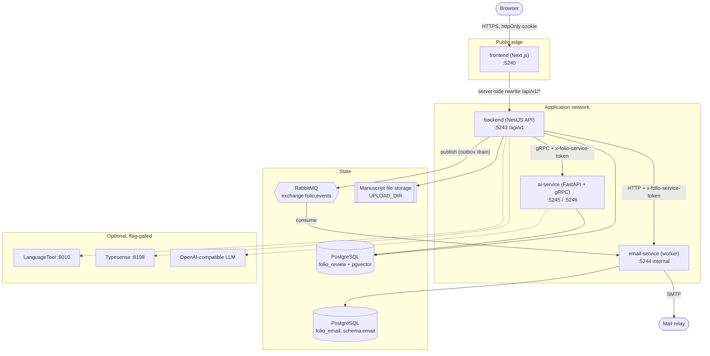
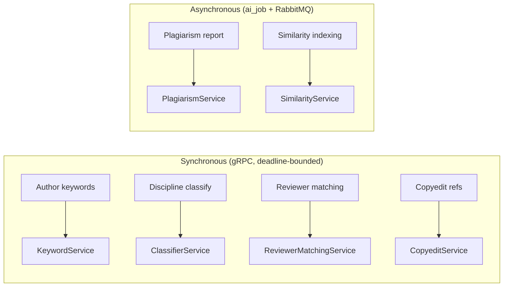

# Architecture

System-level view of Folio, the Damascus University Journal peer-review workspace: what each
component owns, how components talk to each other, and which boundaries are deliberate.

For the product behaviour behind these components see
[`PRODUCT-SPECIFICATION.md`](./PRODUCT-SPECIFICATION.md); for entities and lifecycle see
[`DATA-MODEL.md`](./DATA-MODEL.md).

---

## 1. Components

| Component | Technology | Listens on | Owns |
|-----------|-----------|-----------|------|
| `frontend/` | Next.js (App Router, next-intl, Tailwind v4) | HTTP **5240** | All browser UI, i18n (en/ar + RTL), server-side proxy to the API |
| `backend/` | NestJS + TypeORM | HTTP **5243** (`/api/v1`) | Domain model, authentication, RBAC, workflow, uploads, event outbox, AI job orchestration |
| `services/email-service/` | NestJS worker | HTTP **5244** (`/health`, `/internal/*`) | Transactional email, Handlebars templates, reminder scheduling, email log |
| `services/ai-service/` | Python FastAPI + gRPC | HTTP **5245**, gRPC **5246** | Classification, keywords, embeddings, plagiarism stages, reviewer matching, copyedit checks |
| `packages/shared/` | TypeScript library | — | Event contracts, RabbitMQ topology, idempotency keys, log redaction, entity IDs |
| `packages/nest-observability/` | TypeScript library | — | Pino logging, request/trace correlation, OTLP export wiring |
| `proto/` | Protobuf + Buf | — | The gRPC contract between backend and ai-service; stubs are generated and committed |

Supporting infrastructure: **PostgreSQL** (two databases), **RabbitMQ**, and — optional, feature-flagged —
**LanguageTool** and **Typesense**.

---

## 2. Runtime topology



**The browser only ever talks to the frontend.** `NEXT_PUBLIC_API_URL` is empty by default; the
app calls same-origin `/api/v1/*` and Next.js rewrites it to `API_PROXY_TARGET`. That keeps the
access token in an httpOnly cookie and keeps the API off the public origin. Neither ai-service
nor email-service is reachable from a browser in any supported configuration.

---

## 3. Communication boundaries

| Edge | Transport | Auth | Failure behaviour |
|------|-----------|------|-------------------|
| browser → frontend | HTTPS | `folio_access` httpOnly cookie + CSRF | Normal web errors |
| frontend → backend | HTTP (server-side rewrite) | forwards the cookie | 502 surfaced as UI error |
| backend → ai-service | gRPC | `x-folio-service-token` metadata | Deadline (`AI_SERVICE_TIMEOUT_MS`), feature degrades — never blocks submission |
| backend → email-service | HTTP `/internal/*` | `x-folio-service-token` header | Admin email screens degrade; delivery is unaffected (it is queue-driven) |
| backend → RabbitMQ | AMQP | broker credentials | Events stay in the outbox and are retried |
| email-service → RabbitMQ | AMQP | broker credentials | Unacked messages redeliver; poison messages land in the DLQ |

Both service tokens are mandatory once the listener is not on loopback. ai-service **refuses to
start** with a non-loopback `GRPC_BIND_HOST` and no `AI_SERVICE_TOKEN` — a container bind can
therefore never be accidentally open.

---

## 4. Event flow: transactional outbox

Email is never sent inline with a request. The API writes an `outbound_event` row **in the same
transaction** as the domain change, and a drainer publishes it afterwards.

```mermaid
sequenceDiagram
    autonumber
    participant API as backend
    participant DB as folio_review
    participant Drain as OutboxDrainer
    participant MQ as RabbitMQ
    participant W as email-service

    API->>DB: BEGIN; domain write + INSERT outbound_event; COMMIT
    Drain->>DB: poll unpublished events
    Drain->>MQ: publish(routing key, payload)
    Drain->>DB: mark published
    MQ->>W: deliver
    W->>W: idempotency key seen before?
    W-->>MQ: ack (duplicate → drop)
    W->>W: render template, send, write email_log
```

Why it is built this way:

- **No lost mail on broker downtime.** The domain transaction commits regardless; publication retries.
- **No phantom mail on rollback.** The event row dies with the transaction that produced it.
- **At-least-once delivery is safe** because idempotency keys are built from shared code
  (`packages/shared/messaging/idempotency.ts`) that both sides import — the producer and consumer
  cannot drift apart.

Failed messages route to a dead-letter queue with replay tooling
(`backend/src/messaging/dlq-replay.service.ts`); runbook in
[`testing-email-pipeline.md`](./testing-email-pipeline.md).

---

## 5. AI request paths

Two distinct paths, chosen by cost:

**Synchronous gRPC** — keyword suggestions, discipline classification, reviewer matching,
copyedit reference checks. Sub-request latency, deadline-bounded, degrades to "unavailable"
in the UI when the service is off.

**Asynchronous jobs** — plagiarism reports and similarity indexing. The API enqueues an
`ai_job`, publishes to RabbitMQ, and an in-process worker (`AI_JOBS_CONSUMER_ENABLED`) executes
it against ai-service with a long deadline (`AI_CORPUS_SIMILARITY_TIMEOUT_MS`, default 300 s).
The client polls job status; nothing blocks on a multi-minute computation.



Every AI capability is gated **twice**: a flag on the API (`AI_*_ENABLED`) and a flag on
ai-service (`SIMILARITY_ENABLED`, `EXACT_MATCH_ENABLED`, …). Both must be on. The flags exist so
a deployment can run the journal with no AI at all, or with only the parts whose Python extras
it installed — see [`CONFIGURATION.md`](./CONFIGURATION.md) and
[`AI-FEATURES.md`](./AI-FEATURES.md).

### Plagiarism stages

| Stage | Needs | Detects | Blind spot |
|-------|-------|---------|-----------|
| Exact overlap | `corpus` extra + fingerprint corpus | Verbatim reuse against indexed documents | Paraphrase — changing one word in ten defeats it |
| Semantic similarity | `similarity` extra + pgvector | Reworded reuse of indexed articles | Sources outside the corpus |
| Web | `web_similarity` extra + Google CSE | Reuse of public web sources | Paywalled and offline sources |

Two rules are load-bearing, not incidental:
**authors cannot run corpus similarity against their own submission** (otherwise they iterate
until they evade detection), and **matches against non-published submissions never reach a
report**.

---

## 5b. The press: journal → issue → article

Folio models a **university press of nine journals**, not one journal with topic
tags. That shape is load-bearing across components, so it is worth stating once:

```
Press (portal)  →  Journal (engj)  →  Issue (العدد 2، 2026)  →  Article
```

- **Journals are reference data, not user content.** Nine rows, one per Damascus
  University series, inserted by migration from
  `backend/src/journals/journal-catalog.ts` and 1:1 with the AraBERT classifier
  labels — so a classification maps to exactly one journal and no second
  taxonomy exists. Slugs are a **frozen public URL contract**.
- **Every submission has a journal from creation** (`submissions.journal_id`,
  `NOT NULL`). The author chooses it in the submission wizard.
- **Staff scope is a membership, not a role.** `journal_memberships` answers
  "which journals may this editor act in"; RBAC answers "what may they do".
  `journal_manager` is university-wide and holds no membership rows.
- **Publishing requires an issue.** Without one an article has no citation and
  the public archive has nowhere to list it, so `publishSubmission` takes an
  `issueId` and stamps it in the same transaction as the status flip.
- **The portal exposes only `published` issues and `published` articles**, so a
  retraction disappears from the public site without deleting history.

The reader-facing surface (`/public/journals*`, unauthenticated) and the
editorial surface (journal-scoped queues) read the same tables from opposite
ends: the portal filters on publication status, the queue filters on membership.

---

## 6. Data ownership

| Store | Owner | Notes |
|-------|-------|-------|
| `folio_review` (schema `public`) | backend | Users, roles, submissions, reviews, copyediting, audit log, outbox, AI jobs |
| `folio_review` (pgvector tables) | ai-service | Embeddings and corpus fingerprints, written directly by the Python service |
| `folio_email` (schema `email`) | email-service | Email log, templates, reminder policy and schedule |
| `UPLOAD_DIR` | backend | Manuscript files; the only stateful directory the API writes |

No service reads another service's schema. The email database is physically separate so that
mail volume, retention and restores never touch editorial data.

**Text retention is deliberately asymmetric** in the plagiarism corpus: full text is kept only
for `folio_submission` and `back_catalog` sources; `external_oa` and `web` sources are
fingerprint-only, so third-party articles are never stored verbatim.

---

## 7. Cross-cutting concerns

**Identity and access.** JWT access token (short-lived, httpOnly cookie) plus refresh session
rows that can be revoked. Authorisation runs in two layers — a route guard for coarse role
checks and service-level caller/resource checks for ownership and workflow state. Both layers
are required; the route guard alone cannot express "this editor owns this submission". See
[`authorization.md`](./authorization.md). Roles: `author`, `reviewer`, `editor`,
`section_editor`, `copyeditor`, `journal_manager`.

**Observability.** All three Node/Python services emit structured JSON logs with request and
trace correlation, and export OTLP traces when `OTEL_TRACES_EXPORTER=otlp`. Log redaction is
shared code, so PII stripping is identical in the API and the worker. See
[`OBSERVABILITY.md`](./OBSERVABILITY.md).

**Rate limiting.** Per-handler throttle profiles (login, register, upload, DOCX conversion, SSE,
public) rather than one global bucket, because these endpoints have wildly different cost.

**Auditing.** Request-level audit log with configurable sampling and a nightly retention purge.

---

## 8. Deployment shapes

| Shape | Compose file | Use |
|-------|--------------|-----|
| Full stack, built images, no bind mounts | `docker-compose.yml` | Deployment and release verification |
| Everything containerised with hot reload | `docker-compose.local.yml` | One-command local stack (heavy on Windows) |
| Infra + containerised Postgres | `docker-compose.dev.yml` | Native app services, containerised state |
| Infra only (RabbitMQ, LanguageTool, Typesense) | `docker-compose.infra.yml` | Native app services **and** native Postgres — lightest on Windows |

Image build, hardening and operations: [`DEPLOYMENT.md`](./DEPLOYMENT.md).
Local setup: [`DEVELOPMENT.md`](./DEVELOPMENT.md).

---

## 9. Design decisions worth knowing

| Decision | Rationale |
|----------|-----------|
| Browser never calls the API directly | Access token stays in an httpOnly cookie; API is not a public origin |
| Transactional outbox instead of inline send | Mail cannot be lost by broker downtime or sent for a rolled-back transaction |
| Contracts in `packages/shared`, linked with npm `file:` | Producer and consumer cannot drift; no copied type definitions |
| gRPC (not REST) to ai-service | Typed contract, generated stubs on both sides, breaking changes caught by `buf` |
| Separate email database | Mail retention and restore never touch editorial data |
| Python extras split (`corpus` / `similarity` / `ml`) | Exact-match plagiarism runs in ~250 MB; embeddings are opt-in multi-GB |
| Every AI feature double-flagged | A deployment can run the journal with no AI, or only the parts it installed |
| Generated protobuf stubs committed | Contributors do not need the Buf toolchain unless they change `.proto` |
