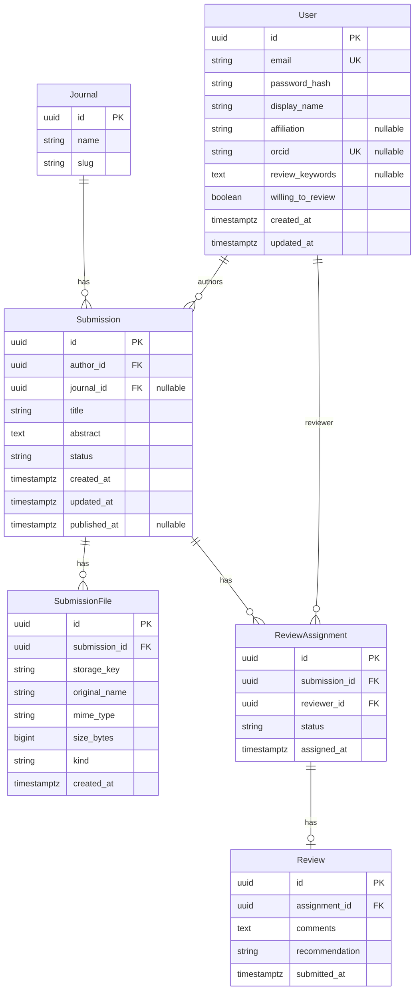

# Data model (MVP)

PostgreSQL as the system of record. User stories: [`USER-STORIES.md`](./USER-STORIES.md). API resources: [`API-NOTES.md`](./API-NOTES.md).

## Entities

### Journal (optional stub)

Single row for “the one journal” (name, slug, ISSN optional). Simplifies future multi-journal expansion without MVP complexity. Omit the table if you hard-code journal metadata in config.

### User

- Identity: email (unique), password hash, display name.
- Researcher profile (editorial-manager style): optional **affiliation** (text), optional **ORCID** (unique when set), optional **review keywords / interests** (text), **willing to review** (boolean). New accounts default to **author**; reviewer candidates for assignment are users with the reviewer role **and** `willing_to_review = true`.
- Roles: `user_roles` join to `role` (and role → permission). MVP allows multiple roles per user.

### Submission

- Belongs to one **author** (`User` as `author_id`).
- Optional `journal_id` if you use the `Journal` table.
- Metadata: **title**, **abstract**, **article type** (enum), **keywords** (comma/semicolon-separated; 3–6 on submit), **contributors** (JSON array: full name, optional email, affiliation, sort order, corresponding flag), **funding statement**, **declarations** (conflict of interest, ethics/IRB reference, originality confirmation, AI-use statement), **suggested / opposed reviewers** (JSON arrays, max 5 each).
- **`review_method`** (OJS-aligned enum, default `double_anonymous`): `open` | `anonymous` | `double_anonymous`. In UI/docs, label **`anonymous`** as **single-blind** (reviewer identity hidden from author; author identity still visible to reviewer unless `double_anonymous`).
- `status`: see [Submission lifecycle](#submission-lifecycle) (store as enum or constrained text).
- Timestamps: `created_at`, `updated_at`; optional `published_at` when `status = published`.

### SubmissionFile

- Belongs to one `Submission`.
- Fields: `storage_key` or path, original filename, MIME type, size, **`kind`**: `cover_letter` | `title_page` | `manuscript` | `figure` | `table` | `supplementary` (submit requires at least one file of each of the first three kinds), **`file_stage`**: `submission` (editorial package, default on author upload) | `review` (curated **review package** visible to reviewers), `created_at`.
- **Review package (uniform rule):** Reviewers may **only** download files with `file_stage = review`. Editors move or duplicate manuscripts into the review package before setting `under_review` or before a reviewer **accepts** (implementation requires ≥ one `manuscript` in `review` for those transitions). `open` review still uses a curated review file set; it does not grant reviewers the full submission tree.
- **File storage:** MVP default is local disk under something like `uploads/` (ignored by git via root `.gitignore`). Object storage (S3-compatible) is a later swap—keep DB metadata stable.

### ReviewAssignment

- Links `Submission` + `Reviewer` (`User` with reviewer role).
- Fields: `assigned_at`, optional `due_at`, `status`: `invited` (editor invited; no file access yet) | `accepted` (reviewer agreed; can read and submit) | `declined` | `completed` (review filed).

### RoleInvitation (staff roles)

- `invitee_user_id`, `invited_by_user_id`, `role_slug` (MVP: `editor` only via API), `status` (`invited` | `accepted` | `declined`), `created_at`, optional `resolved_at`. Roles are applied only on **accept**.

### Review

- Belongs to one `ReviewAssignment` (one review document per assignment).
- Fields: `comments_for_author` (text, may be shown to the author), `comments_to_editor_only` (text, confidential to editors), `recommendation` (e.g. `accept` | `reject` | `revisions`), `submitted_at`. **At least one** of the two comment fields must be non-empty on submit.

---

## Review method × files × metadata (API responses for reviewers)

| `review_method` | Reviewer file downloads | Reviewer JSON (submission detail / `assignments/me`) |
|-----------------|-------------------------|------------------------------------------------------|
| `open` | `file_stage = review` only | Full metadata; **no** `constructor_content`, **no** `review_assignments` (avoid co-reviewer leak). |
| `anonymous` (single-blind) | `file_stage = review` only | Same visibility as open for author identity; same global omissions. |
| `double_anonymous` | `file_stage = review` only | Strip identifying fields (`author_id`, `author`, `contributors`, funding, COI, ethics, AI, etc.); same global omissions. |

---

## Submission lifecycle

Canonical **`status`** values on `Submission` (use these strings in API and UI):

| Status | Meaning |
|--------|---------|
| `draft` | Author editable; not visible to editor queue as “incoming” unless you choose to show drafts (default: no). |
| `submitted` | With editor; ready for assignment / in queue. |
| `under_review` | At least one active assignment; reviewers working. |
| `revisions_requested` | Editor sent back to author for changes. |
| `accepted` | Editorial accept; not yet on public site. |
| `rejected` | Terminal; not published. |
| `published` | Visible in public catalog with file access per policy. |

**State machine (narrative):** The author creates a `draft`, then moves to `submitted`. The editor assigns reviewers and typically sets `under_review`. When enough reviews exist, the editor sets `accepted`, `rejected`, or `revisions_requested`. From `revisions_requested`, the author resubmits and status returns to `submitted` (then editor may set `under_review` again). From `accepted`, the editor transitions to `published`. `rejected` does not move to `published` without a new submission (out of scope unless you define reopen).

Adjust edge cases in implementation, but **keep the same status strings** as [`API-NOTES.md`](./API-NOTES.md).

---

## ER diagram (Mermaid)

If you omit `Journal`, drop `journal_id` from `Submission` until needed.

---

## Indexes (implementation hint)

- `Submission(author_id)`, `Submission(status)`, `Submission(published_at)` for lists.
- `ReviewAssignment(reviewer_id)`, `ReviewAssignment(submission_id)`.
- `User(email)` unique; `User(orcid)` unique where not null.
