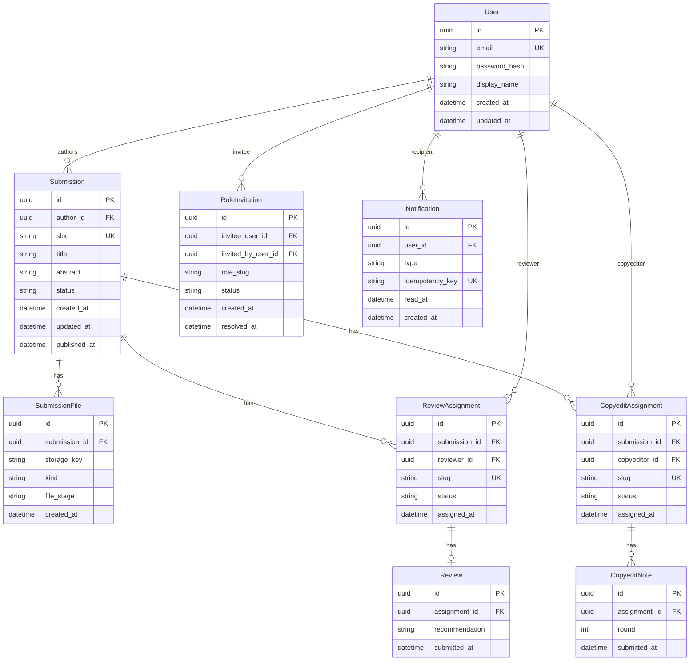

# Data model (MVP)

PostgreSQL as the system of record. Role workflows: [`feature-report.md`](./feature-report.md). API resources: [`API-NOTES.md`](./API-NOTES.md).

**Primary keys:** entity `id` columns are PostgreSQL `uuid`, generated in application code as **UUID v7** (time-ordered, RFC 4122) via `generateEntityId()` from `@folio/shared`. Public workflow URLs use **slugs** on `Submission`, `ReviewAssignment`, `CopyeditAssignment`, `Role`, and `Permission` — not the raw UUID.

## Entities

### Journal

Folio is a **university press of many journals**, not one journal with topic
tags. `journals` holds one row per Damascus University series (`artsj`, `hisj`,
`basj`, `econj`, `eduj`, `agrj`, `medj`, `lawj`, `engj`).

- `slug` (unique) — **public URL contract**, mirrors the DU OJS paths
  (`/journals/engj/issues/2026/3`). Frozen: changing one breaks live links.
- `title_ar` / `title_en`, optional `issn` / `eissn`, optional descriptions.
- `discipline_label` (unique) — the exact Arabic label the AraBERT classifier
  emits, so a classification maps to at most one journal and there is no second
  taxonomy. `غير محدد` is deliberately **not** a journal.
- `is_active` — soft hide from the author picker and the public portal; rows are
  never deleted, so an archive survives a journal being retired.
- `sort_order` — catalog display order.

Rows are reference data: the `MultiJournalIssues` migration inserts them from
`backend/src/journals/journal-catalog.ts` so the foreign key is satisfiable on
any database, and `seed.ts` looks them up by slug rather than re-creating them.

### JournalIssue (العدد)

One issue of one journal, cited as **العدد N، السنة YYYY**.

- `journal_id`, `year`, `number`, optional `volume`, optional bilingual titles.
- Unique on `(journal_id, year, number)`.
- `status`: `open` | `published` | `closed`. Issues that can receive an article
  are **open OR published** — a released issue gains rolling additions, which is
  how the DU series actually works.
- `published_at` when released.

### JournalMembership

Which journals a staff user serves, and in what role — the single source of
truth for journal-scoped queues.

- `(journal_id, user_id, role_slug)` unique.
- Replaced the old `user_section_editor_disciplines` table (migration
  `JournalScopedSectionEditors`).
- `journal_manager` is deliberately **not** scoped by membership: it is a
  university-wide role.

### User

- Identity: email (unique), password hash, display name.
- Researcher profile (editorial-manager style): optional **affiliation** (text), optional **ORCID** (unique when set), optional **review keywords / interests** (text), **willing to review** (boolean). New accounts default to **author**; reviewer candidates for assignment are users with the reviewer role **and** `willing_to_review = true`.
- Roles: `user_roles` join to `role` (and role → permission). MVP allows multiple roles per user. Manuscript create/edit/submit is gated by permission **`submission.manage_own`** (author role only). Staff roles: **`editor`** (handling editor — workflow decisions), **`journal_manager`** (users, email platform, queue oversight), **`reviewer`**, **`copyeditor`**. Editor and journal manager require invitation; reviewer/copyeditor can be assigned by a journal manager via `PATCH /users/:id/roles`.

### Submission

- Belongs to one **author** (`User` as `author_id`).
- **`journal_id` (NOT NULL)** — the editorial home, chosen by the author in the
  submission wizard. Landed nullable in `MultiJournalIssues` (no picker existed
  yet) and was tightened by `SubmissionJournalRequired` once
  `CreateSubmissionDto` could set it. Everything downstream keys on it: the
  editor queue scope, the issues an article may be published into, and the
  public portal.
- **`issue_id`** (nullable) — the issue the article was filed into. Null until
  publish; publishing without an issue is rejected. Always inside `journal_id`'s
  journal.
- Metadata: **title**, **abstract**, **article type** (enum), **keywords** (comma/semicolon-separated; 3–6 on submit), **contributors** (JSON array: full name, optional email, affiliation, sort order, corresponding flag), **funding statement**, **declarations** (conflict of interest, ethics/IRB reference, originality confirmation, AI-use statement), **suggested / opposed reviewers** (JSON arrays, max 5 each).
- **Discipline (Arabic journal scope, OJS category-like):** optional **`disciplines`** (`text[]`, confirmed labels, max 3), **`discipline_source`** (`ai` \| `author` \| `editor`), **`discipline_suggested_labels`** (`text[]`) + **`discipline_suggested_confidence`** (from AraBERT on suggest/submit), **`discipline_classification`** (JSONB snapshot of top labels/scores). Authors confirm via API; editors may override. Catalog filter and corpus similarity can scope by any confirmed label (similarity uses first).
- **`constructor_content`** (JSONB, nullable): Word Constructor document when the author uses builder mode; omitted from reviewer payloads.
- **`review_manuscript_presentation`** (JSONB, nullable): Which sources (upload / constructor `.docx`) are in the review package at submit.
- **`review_method`** (OJS-aligned enum, default `double_anonymous`): `open` | `anonymous` | `double_anonymous`. In UI/docs, label **`anonymous`** as **single-blind** (reviewer identity hidden from author; author identity still visible to reviewer unless `double_anonymous`).
- `status`: see [Submission lifecycle](#submission-lifecycle) (store as enum or constrained text).
- **`revision_severity`** (`minor` | `major`, nullable): severity of the current `revisions_requested` decision. Deliberately **not** a status value, so every existing status guard keeps working; cleared on accept/reject.
- **`revision_round`** (int, default 0): incremented on each `revisions_requested` decision, kept as history afterwards. Threaded into the `submission.decision` and `submission.submitted` idempotency keys so round N+1 is not deduped against round N.
- Timestamps: `created_at`, `updated_at`; optional `published_at` when `status = published`.

### SubmissionFile

- Belongs to one `Submission`.
- Fields: `storage_key` or path, original filename, MIME type, size, **`kind`**: `cover_letter` | `title_page` | `manuscript` | `manuscript_constructor` | `figure` | `table` | `supplementary` | `review_response` (submit requires at least one file of each of the first three kinds), **`file_stage`**: `submission` (editorial package, default on author upload) | `review` (curated **review package** visible to reviewers), `created_at`.
- **Review package (uniform rule):** Reviewers may **only** download files with `file_stage = review`. Editors move or duplicate manuscripts into the review package before setting `under_review` or before a reviewer **accepts** (implementation requires ≥ one `manuscript` in `review` for those transitions). `open` review still uses a curated review file set; it does not grant reviewers the full submission tree.
- **`released_to_author_at` / `released_by_id`** (nullable): meaningful only for `kind = review_response`. Null means editor-only; set when an editor releases a reviewer's review file to the author, either via the decision (`releaseReviewFileIds`) or `PATCH …/files/:fileId/release`. The author sees released files under an anonymised name.
- **File storage:** MVP default is local disk under something like `uploads/` (ignored by git via root `.gitignore`). Object storage (S3-compatible) is a later swap—keep DB metadata stable.

### ReviewAssignment

- Links `Submission` + `Reviewer` (`User` with reviewer role).
- Fields: `assigned_at`, optional `due_at`, `status`: `invited` (editor invited; no file access yet) | `accepted` (reviewer agreed; can read and submit) | `declined` | `completed` (review filed).
- **`responded_at`** (nullable): when the reviewer accepted or declined. Feeds the author's anonymised review timeline; null for assignments answered before this field existed.

### RoleInvitation (staff roles)

- `invitee_user_id`, `invited_by_user_id`, `role_slug` (`editor` | `journal_manager` via API), `status` (`invited` | `accepted` | `declined`), `created_at`, optional `resolved_at`. Roles are applied only on **accept**. Direct `PATCH …/roles` cannot newly add these slugs without invitation.

### Review

- Belongs to one `ReviewAssignment` (one review document per assignment).
- Fields: `comments_for_author` (text, may be shown to the author), `comments_to_editor_only` (text, confidential to editors), `recommendation` (`accept` | `minor_revisions` | `major_revisions` | `resubmit_for_review` | `resubmit_elsewhere` | `reject` | `see_comments`; the undifferentiated `revisions` value is retained for rows written before the minor/major split), `submitted_at`. **At least one** of the two comment fields must be non-empty on submit.

### CopyeditAssignment

- Links `Submission` + **copyeditor** (`User` with copyeditor role).
- Fields: `slug` (unique, used in URLs), `status`: `active` | `awaiting_author` | `ready_for_review`, `assigned_at`.
- Multiple copyeditors per submission allowed; duplicate copyeditor per submission rejected.
- When the editor assigns the first copyeditor on an `accepted` submission, submission `status` moves to `copyediting`.

### CopyeditNote

- Belongs to one `CopyeditAssignment` (many rounds per assignment).
- Fields: `round` (1-based, monotonic per assignment), `note_for_author`, `note_to_editor_only`, `submitted_at`.
- Submitting a note moves assignment to `awaiting_author` and emails the author.

### Notification (in-app inbox)

- Belongs to one **recipient** `User` (`user_id`).
- Fields: `type` (stable string, e.g. `submission_submitted`), `title_key` / `body_key` (frontend i18n keys), `params` (JSONB, no email addresses), `href` (locale-less app path), `idempotency_key` (unique), `read_at` (null = unread), `created_at`.
- Rows are retained in v1 (no delete); SSE emits only **after** the insert transaction commits.

### OAuthIdentity (ORCID link)

- Belongs to one `User`.
- Fields: `provider` (e.g. `orcid`), `provider_user_id` (ORCID iD), `display_name`, `access_token` (encrypted), `refresh_token` (encrypted), `token_expiry`, `raw_profile` (JSONB), `created_at`, `updated_at`.
- Enabled when `ORCID_ENABLED=true` in `backend/.env`. A user may have at most one ORCID identity (`UNIQUE (user_id, provider)`).

### AuditLog

- Records every non-health API request to the backend.
- Fields: `user_id` (nullable), `user_email`, `user_roles` (text array), `method`, `route_pattern` (controller route, e.g. `/submissions/:slug`), `path` (actual URL), `status_code`, `ip_address`, `user_agent`, `request_body` (JSONB, sensitive keys redacted), `params` (JSONB), `duration_ms`, `action_type` (classified verb, e.g. `CREATE`, `UPDATE`, `DELETE`), `resource_type` (e.g. `SUBMISSION`, `USER`), `resource_id`, `occurred_at`, `error` (text, when applicable).
- Indexes: `(user_id, occurred_at)`, `(occurred_at)`, `(route_pattern, occurred_at)`, `(action_type, occurred_at)`, `(resource_type, resource_id, occurred_at)`.
- Sampling controlled by `AUDIT_SAMPLE_RATE` in `backend/.env` (0.0–1.0, default 1.0).

### SearchSyncCheckpoint

- Single-row table (id = 1) tracking the `last_synced_at` timestamp for incremental Typesense publication sync.
- Enables the `SearchSyncService` to resume from the last checkpoint after restarts without a full reindex.

---

## Review method × files × metadata (API responses for reviewers)

| `review_method` | Reviewer file downloads | Reviewer JSON (submission detail / `assignments/me`) |
|-----------------|-------------------------|------------------------------------------------------|
| `open` | `file_stage = review` only | Full metadata; **no** `constructor_content`, **no** `review_assignments` (avoid co-reviewer leak). |
| `anonymous` (single-blind) | `file_stage = review` only | Same visibility as open for author identity; same global omissions. |
| `double_anonymous` | `file_stage = review` only | Strip identifying fields (`author_id`, `author`, `contributors`, funding, COI, ethics, AI, etc.); same global omissions. |

---

## Submission lifecycle

Canonical **`status`** values on `Submission` (use these strings in API and UI):

| Status | Meaning |
|--------|---------|
| `draft` | Author editable; not visible to editor queue as “incoming” unless you choose to show drafts (default: no). |
| `submitted` | With editor; ready for assignment / in queue. |
| `under_review` | At least one active assignment; reviewers working. |
| `revisions_requested` | Editor sent back to author for changes. |
| `accepted` | Editorial accept; not yet on public site. |
| `rejected` | Terminal; not published. |
| `copyediting` | Accepted manuscript in production editing; one or more copyeditors assigned. |
| `published` | Visible in public catalog with file access per policy. |
| `retracted` | Was published; removed from the public catalog. Terminal. |

**State machine (narrative):** The author creates a `draft`, then moves to `submitted`. The editor assigns reviewers and sets `under_review` via `PATCH .../status` (or status advances automatically on the first reviewer **accept** while still `submitted`, if a review-package manuscript exists). When enough reviews exist, the editor sets `accepted`, `rejected`, or `revisions_requested`. From `revisions_requested`, the author resubmits and status returns to `submitted` (then the editor may set `under_review` again). From `accepted`, copyediting and publish follow [`API-NOTES.md`](./API-NOTES.md). `rejected` does not move to `published` without a new submission (out of scope unless you define reopen).

Adjust edge cases in implementation, but **keep the same status strings** as [`API-NOTES.md`](./API-NOTES.md).

---

## ER diagram (Mermaid)

**ER diagrams (by domain):** [`diagrams/erd/README.md`](./diagrams/erd/README.md) — six focused Mermaid files (`01`–`06`). **ER diagrams (by role):** [`diagrams/erd-by-role/README.md`](./diagrams/erd-by-role/README.md). **Class diagrams (TypeORM):** [`diagrams/class/folio-overview.mmd`](./diagrams/class/folio-overview.mmd) (one Mermaid diagram, all roles) · [`diagrams/class/README.md`](./diagrams/class/README.md) (by domain) · [`diagrams/class-by-role/README.md`](./diagrams/class-by-role/README.md) (by role). **All links in one table:** [`diagrams/erd/LINKS.md`](./diagrams/erd/LINKS.md). Compact overview (no columns): [`diagrams/erd/folio-overview.puml`](./diagrams/erd/folio-overview.puml) / [`folio-overview.mmd`](./diagrams/erd/folio-overview.mmd). Optional full detail: [`diagrams/erd/folio-full.mmd`](./diagrams/erd/folio-full.mmd).

Mermaid `erDiagram` attributes must use `type name [PK|FK|UK]` only — no commas (`FK,UK`), no quoted `"nullable"`, avoid `enum` / `jsonb` / `timestamptz` as types (use `string`, `json`, `datetime`).

Simplified view (journal → issue → article is the spine of the press):

```mermaid
erDiagram
  User ||--o{ Submission : authors
  Submission ||--o{ SubmissionFile : has
  Submission ||--o{ ReviewAssignment : has
  Submission ||--o{ CopyeditAssignment : has
  User ||--o{ ReviewAssignment : reviewer
  User ||--o{ CopyeditAssignment : copyeditor
  User ||--o{ RoleInvitation : invitee
  User ||--o{ Notification : recipient
  ReviewAssignment ||--o| Review : has
  CopyeditAssignment ||--o{ CopyeditNote : has

  User {
    uuid id PK
    string email UK
    string password_hash
    string display_name
    datetime created_at
    datetime updated_at
  }

  Submission {
    uuid id PK
    uuid author_id FK
    string slug UK
    string title
    string abstract
    string status
    datetime created_at
    datetime updated_at
    datetime published_at
  }

  SubmissionFile {
    uuid id PK
    uuid submission_id FK
    string storage_key
    string kind
    string file_stage
    datetime created_at
  }

  ReviewAssignment {
    uuid id PK
    uuid submission_id FK
    uuid reviewer_id FK
    string slug UK
    string status
    datetime assigned_at
  }

  Review {
    uuid id PK
    uuid assignment_id FK
    string recommendation
    datetime submitted_at
  }

  CopyeditAssignment {
    uuid id PK
    uuid submission_id FK
    uuid copyeditor_id FK
    string slug UK
    string status
    datetime assigned_at
  }

  CopyeditNote {
    uuid id PK
    uuid assignment_id FK
    int round
    datetime submitted_at
  }

  RoleInvitation {
    uuid id PK
    uuid invitee_user_id FK
    uuid invited_by_user_id FK
    string role_slug
    string status
    datetime created_at
    datetime resolved_at
  }

  Notification {
    uuid id PK
    uuid user_id FK
    string type
    string idempotency_key UK
    datetime read_at
    datetime created_at
  }
```

---

## Indexes (implementation hint)

- `submissions(journal_id, status, updated_at DESC)` — journal-scoped editor queue (`ix_submissions_journal_status_updated_at`).
- `submissions(issue_id, published_at)` — issue table of contents (`ix_submissions_issue_published_at`).
- `journal_memberships(user_id, role_slug)` and `(journal_id, role_slug)` — staff scope lookups both directions.
- `submissions(status, updated_at DESC)` — editor queue (`ix_submissions_status_updated_at`).
- `submissions(author_id, updated_at DESC)` — author list (`ix_submissions_author_updated_at`).
- `submissions(status, published_at)` — catalog ordering, search sync (`ix_submissions_status_published_at`).
- `submissions(status, similarity_indexed_at) WHERE similarity_indexed_at IS NULL` — pending similarity index (`ix_submissions_similarity_pending`).
- `review_assignments(reviewer_id, assigned_at DESC)` — reviewer inbox (`ix_review_assignments_reviewer_assigned`).
- `review_assignments(submission_id)` — per-submission assignment list (`ix_review_assignments_submission_id`).
- `CopyeditAssignment(copyeditor_id)`, `CopyeditAssignment(submission_id)`.
- `Notification(user_id, read_at)`, `Notification(idempotency_key)` unique.
- `outbound_event_outbox(status, next_attempt_at)` — outbox drainer.
- `User(email)` unique; `User(orcid)` unique where not null.
- `OAuthIdentity(user_id, provider)` unique.
- `AuditLog(user_id, occurred_at)`, `(occurred_at)`, `(route_pattern, occurred_at)`, `(action_type, occurred_at)`, `(resource_type, resource_id, occurred_at)`.
