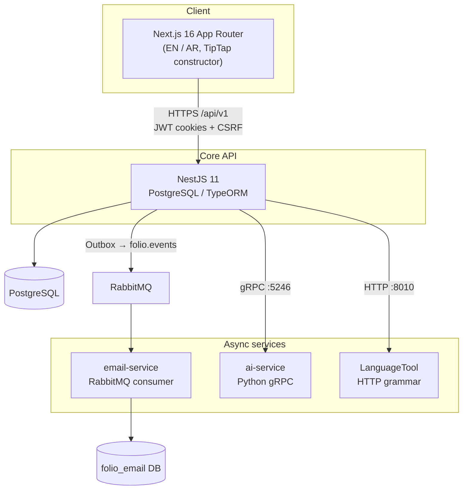
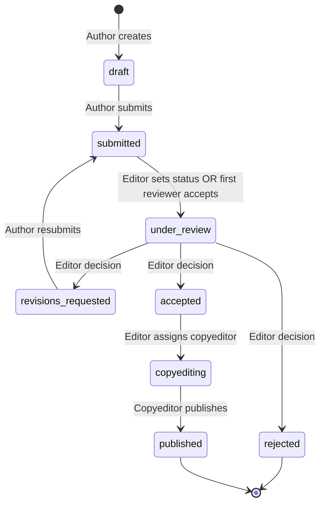

# Damascus University Journal — Product Specification

**Version:** 1.0 (as-built)  
**Status:** Pre-production / active development  
**Last verified against codebase:** June 2026  

This document describes **what Damascus University Journal is and what it does today**, derived from the running implementation (backend, frontend, email-service, ai-service). Older docs in `docs/` may drift; treat this file plus [`API-NOTES.md`](./API-NOTES.md) and [`DATA-MODEL.md`](./DATA-MODEL.md) as the primary product references.

---

## 1. Product overview

### 1.1 Vision

**Damascus University Journal** is a scholarly **manuscript submission and peer-review workspace** for a single academic journal. It supports the full editorial lifecycle—from author draft through peer review, copyediting, and public publication—with role-based access, bilingual (English / Arabic) UI, optional AI assistance, and a decoupled email pipeline.

The product is **OJS-inspired in workflow vocabulary** but is an **original implementation** (not a fork or port of Open Journal Systems).

### 1.2 Problem statement

Academic journals need a system where:

- Authors can submit structured manuscripts (upload or in-app builder) with rich metadata and declarations.
- Editors manage a queue, configure blind-review policy, assign reviewers, and record editorial decisions.
- Reviewers accept invitations, access only the curated review package, and submit structured reviews.
- Copyeditors run production rounds with authors before publication.
- Readers can browse and search a public catalog of published work.
- Staff can operate email templates, reminders, and pipeline health without blocking the API.

### 1.3 Product goals (MVP)

| Goal | Status |
|------|--------|
| End-to-end submission lifecycle with defined status machine | Shipped |
| Role-based permissions for author, editor, journal manager, reviewer, copyeditor | Shipped |
| Bilingual UI (EN / AR, RTL) | Shipped |
| Word Constructor → styled `.docx` export | Shipped |
| Peer review with blind-review modes and review-package gating | Shipped |
| Copyediting workflow with multi-copyeditor support | Shipped |
| Public publication catalog with keyword + optional semantic search | Shipped |
| Transactional email via RabbitMQ microservice | Shipped |
| In-app notifications (REST + SSE) | Shipped |
| Optional AI features (discipline, keywords, similarity, reviewer matching, copyedit analysis) | Shipped (feature-flagged) |
| Multi-journal tenancy | Out of scope (single-journal MVP) |

### 1.4 Out of scope (current release)

- Multi-journal / multi-tenant administration
- Payment, APC, or subscription billing
- DOI registration, Crossref, or external repository push
- Footnotes/endnotes in Word Constructor (planned v2)
- Live multi-user collaborative editing (same-browser tab sync only)
- Reverse-import of uploaded `.docx` into structured constructor content
- Object storage (S3); files use local disk under `uploads/`
- Production-grade horizontal scaling (in-memory rate limits, single-instance SSE)

---

## 2. Users and roles

### 2.1 Personas

| Role | Primary goals |
|------|----------------|
| **Author** | Create drafts, build or upload manuscripts, submit, respond to revisions and copyedit queries |
| **Editor** (handling editor) | Triage queue, set review method, assign reviewers/copyeditors, record decisions, read all reviews |
| **Journal manager** | Onboard users (reviewer/copyeditor grants, editor/JM invitations), manage email platform, oversee queue |
| **Reviewer** | Accept/decline invitations, download review-package files, submit reviews |
| **Copyeditor** | Work production queue, send query rounds, approve readiness, publish when all assignments ready |
| **Reader** (unauthenticated) | Browse/search published catalog, download public files |

Users may hold **multiple roles** (e.g. editor + reviewer). Permissions are enforced by **permission slugs**, not role names alone.

### 2.2 Role assignment rules

| Role | How assigned |
|------|----------------|
| `author` | Default on self-registration |
| `reviewer`, `copyeditor` | Journal manager via `PATCH /users/:id/roles` |
| `editor`, `journal_manager` | Invitation flow only — `POST /users/:id/role-invitations` → invitee accepts; direct role PATCH **cannot** newly add these slugs |

### 2.3 Reviewer pool

Users appear in the editor’s assign-reviewer list only when they have the **reviewer** role **and** `willingToReview = true` on their profile. Reviewers do not self-select manuscripts from a public pool.

### 2.4 Permission model

| Permission slug | Typical holder | Capability |
|-----------------|----------------|------------|
| `submission.manage_own` | Author | Create/edit/submit own manuscripts |
| `submission.view_editor_queue` | Editor, journal manager | View editorial queue |
| `submission.change_status` | Editor | Editorial status transitions |
| `submission.assign_reviewer` | Editor | Create review assignments |
| `submission.list_assignments` | Editor | List assignment reminders |
| `submission.assign_copyeditor` | Editor | Assign copyeditors |
| `assignment.view_own` | Reviewer | View own assignments |
| `review.submit` | Reviewer | Accept/decline/submit reviews |
| `users.manage_roles` | Journal manager | User search, role grants, invitations |
| `email.manage_reminders` | Editor, journal manager | Email templates, reminder policy, pipeline admin |
| `email.manage_assignment_reminders` | Editor | Per-assignment reminder reschedule/cancel |
| `copyedit.view_queue` | Copyeditor | Copyedit assignment queue |
| `copyedit.submit_note` | Copyeditor | Send production query rounds |
| `copyedit.publish` | Copyeditor | Publish when all assignments ready |

---

## 3. System architecture

### 3.1 Components

| Component | Technology | Responsibility |
|-----------|------------|----------------|
| **Frontend** | Next.js 16, React 19, Tailwind 4, TipTap, Radix, `next-intl` | UI, same-origin API proxy, Word Constructor |
| **Backend** | NestJS 11, TypeORM, Passport JWT | REST API, RBAC, business logic, BFF for AI |
| **PostgreSQL** | Primary app DB | Users, submissions, reviews, outbox, notifications |
| **email-service** | NestJS standalone | Consume events, render Handlebars templates, SMTP/noop, cron reminders |
| **ai-service** | Python FastAPI + gRPC | Classifier, keywords, similarity, plagiarism, reviewer matching, copyedit references |
| **packages/shared** | TypeScript workspace | Event contracts, RabbitMQ topology, idempotency keys |
| **proto/** | Buf protobuf | gRPC contracts between Nest and ai-service |

### 3.2 Integration principles

- The **browser never calls ai-service** directly; Nest is the backend-for-frontend.
- **Email is asynchronous**: API writes facts + outbox rows; email-service sends mail.
- **Auth for browsers**: httpOnly `folio_access` JWT cookie, CSRF double-submit (`folio_csrf` + `X-CSRF-Token`).
- **Auth for automation**: `Authorization: Bearer` when `AUTH_RETURN_BEARER=true` (E2E, scripts).
- **Refresh tokens**: Rotating refresh sessions with device listing and revoke (`/auth/sessions`).

### 3.3 Deployment topology (development)

| Service | Default port |
|---------|--------------|
| Frontend | 5240 |
| Backend API | 5243 |
| email-service | 5244 |
| ai-service HTTP (health) | 5245 |
| ai-service gRPC | 5246 |
| RabbitMQ AMQP / management | 5672 / 15672 |
| LanguageTool | 8010 |
| PostgreSQL (app) | 5432 |
| PostgreSQL (email) | 5433 |

---

## 4. Authentication and identity

### 4.1 Registration and login

- **Register** (`POST /auth/register`): email, password, display name; optional affiliation, ORCID, review keywords, `willingToReview`. Default role: author.
- **Login** (`POST /auth/login`): sets access + refresh cookies and CSRF token.
- **Logout** (`POST /auth/logout`): revokes current session server-side; clears cookies.
- **Refresh** (`POST /auth/refresh`): rotates tokens from refresh cookie.
- **Profile**: `GET /auth/me`, `PATCH /auth/me` (locale), `PATCH /auth/me/researcher-profile`.

### 4.2 Email verification

- On register, a **6-digit OTP** is emailed (`auth.verification_otp` event).
- **Unverified users may log in** but are blocked from: submit manuscript, accept/decline review, submit review, accept role invitations (`EMAIL_NOT_VERIFIED`).
- Verify via `POST /auth/verify-email` with `{ code }`; resend via `POST /auth/verify-email/send`.
- Successful first verification triggers welcome email (`auth.registration_welcome`).

### 4.3 Password management

- **Forgot password**: `POST /auth/forgot-password` — always returns `{ ok: true }`; sends magic link when account exists.
- **Reset**: `GET /auth/reset-password/validate?token=`, `POST /auth/reset-password` — revokes all refresh sessions.
- **Set password** (OAuth-only accounts): `POST /auth/me/password`.

### 4.4 ORCID OAuth

- **Login/register**: `GET /auth/orcid` → ORCID OAuth → callback sets session cookies.
- **Link existing account**: `GET /auth/orcid?mode=link` (requires signed-in user).
- **Unlink**: `POST /auth/orcid/unlink`.
- New ORCID users without complete profile redirect to **complete-profile** page.

### 4.5 Session management

- `GET /auth/sessions` — list active refresh sessions (device metadata).
- `DELETE /auth/sessions/:id` — revoke one session.
- `POST /auth/sessions/revoke-others` — revoke all except current.

---

## 5. Submission domain

### 5.1 Submission metadata

| Field | Notes |
|-------|-------|
| Title / abstract | Required; bilingual `titleAr`, `abstractAr` supported |
| Article type | `original_research`, `review_article`, `case_report`, `short_communication`, `other` |
| Keywords | EN + AR; 3–6 required on submit |
| Contributors | JSON array: name, email, affiliation, sort order, corresponding flag |
| Declarations | Funding, conflict of interest, ethics/IRB, originality confirmation, AI usage statement |
| Reviewer preferences | Suggested / opposed reviewers (max 5 each) |
| Discipline | Arabic taxonomy; AI-suggested + author-confirmed; optional journal scope filter |
| `constructor_content` | JSONB Word Constructor document (author/editor only; hidden from reviewers) |
| `review_method` | `open`, `anonymous` (single-blind), `double_anonymous` (default) |
| `message_for_author` | Optional editor message on decision (max 4000 chars) |

### 5.2 Submission statuses

| Status | Meaning |
|--------|---------|
| `draft` | Author-editable; not in editor incoming queue |
| `submitted` | With editorial office |
| `under_review` | Active peer review |
| `revisions_requested` | Returned to author |
| `accepted` | Editorial accept; not yet public |
| `rejected` | Terminal |
| `copyediting` | Production editing (≥1 copyeditor assigned) |
| `published` | Public catalog |

### 5.3 Lifecycle

**Gates:**

- Transition to `under_review` (editor PATCH or auto on first reviewer accept while `submitted`) requires ≥1 **manuscript** file with `file_stage = review`.
- Submit validates journal-style checklist (required file kinds, metadata, declarations).

### 5.4 Manuscript input modes

Authors choose at **new submission**:

1. **File upload** — multipart uploads by kind: `cover_letter`, `title_page`, `manuscript`, `figure`, `table`, `supplementary` (first three required on submit). Max 25 MB; extension + magic-byte validation.
2. **Word Constructor** — structured in-app builder; auto-save; generates `.docx` via backend using manuscript style profile (`damascus-university-journal-v1` default).

Modes are **mutually exclusive** after content exists; switching requires explicit confirmation with cleanup.

**Word Constructor section kinds (v2):** bilingual titles, authors, abstracts, references; optional IMRaD presets; headings, paragraphs, figures, tables (with notes), back-matter blocks (acknowledgments, funding, COI, data availability), LaTeX equations (PNG in `.docx`). Docx import (`POST /submissions/import-docx-to-constructor`) maps headings heuristically with warning codes.

**Constructor limitations (v1):** no footnotes/endnotes, no merged table cells, no inline paragraph images, no cross-device live collab (BroadcastChannel same-browser only).

### 5.5 Files and review package

| `file_stage` | Visibility |
|--------------|------------|
| `submission` | Author, editor (default on author upload) |
| `review` | Assigned reviewers (accepted), editor; **only** stage reviewers may download |

Editors move files to review stage via `PATCH .../files/:fileId/stage`. Reviewers never receive `constructor_content` or co-reviewer assignment lists.

### 5.6 Blind review matrix

| `review_method` | Reviewer sees author identity | Reviewer file access |
|-----------------|------------------------------|----------------------|
| `open` | Yes | `review` stage only |
| `anonymous` (single-blind) | Yes | `review` stage only |
| `double_anonymous` | No (stripped metadata) | `review` stage only |

---

## 6. Peer review

### 6.1 Assignment flow

1. Editor assigns reviewer → assignment `status = invited`; `reviewer.invited` email + scheduled reminders.
2. Reviewer **accepts** → `accepted`; may auto-advance submission `submitted` → `under_review` if review package complete.
3. Reviewer **declines** → `declined`; editors notified.
4. Reviewer submits review → `completed`.

### 6.2 Review content

Each review requires **at least one** of:

- `commentsForAuthor` (may be shown to author)
- `commentsToEditorOnly` (confidential)

Plus `recommendation`: `accept`, `reject`, or `revisions`.

### 6.3 Review visibility

| Viewer | Sees |
|--------|------|
| Editor | All reviews, full text, recommendations, reviewer identity |
| Author | Redacted list: `commentsForAuthor`, `submittedAt` only |
| Reviewer | Own review only (blind to co-reviewers) |

### 6.4 Reminders

- Due-soon and overdue reminders scheduled at invite time; email-service cron publishes `reminder.due`.
- Editors with `email.manage_assignment_reminders` can list/reschedule/cancel per-assignment reminders.

---

## 7. Copyediting

### 7.1 Assignment

- Editor assigns copyeditor(s) on `accepted` submission (`POST /submissions/:slug/copyedit-assignments`).
- First assignment moves status to `copyediting`.
- Multiple copyeditors per submission; duplicate copyeditor rejected.

### 7.2 Assignment statuses

| Status | Meaning |
|--------|---------|
| `active` | Copyeditor working |
| `awaiting_author` | Query round sent; author must respond |
| `ready_for_review` | Author ready or copyeditor approved without author round |

### 7.3 Workflow

1. Copyeditor sends query round (`POST /copyedit-assignments/:slug/notes`) → author emailed.
2. Author uploads revised manuscript + marks ready (`POST .../ready`) → copyeditor emailed.
3. Alternatively, copyeditor **approve-ready** skips author round.
4. When **all** assignments are `ready_for_review`, copyeditor **publishes** (`POST /submissions/:slug/publish`).

### 7.4 Copyedit AI analysis (optional)

`POST /copyedit-assignments/:slug/ai-analysis` returns:

| Check | Source | When disabled |
|-------|--------|---------------|
| Format issues | Local Damascus journal rules | Always runs |
| Grammar/spelling | LanguageTool (`LANGUAGE_TOOL_ENABLED`) | Empty array |
| Reference cross-check | gRPC `CopyeditService` (`AI_COPYEDIT_ENABLED`) | `aiUnavailable: true` |

---

## 8. Publication catalog

### 8.1 Public endpoints

- `GET /public/submissions` — paginated published list.
- `GET /public/submissions/:slug` — detail + downloadable files.
- `GET /public/submissions/author-suggestions` — author filter typeahead.
- `GET /public/submissions/:slug/related` — related articles (when similarity index populated).
- `GET /public/manuscript-styles` — constructor / DOCX style profiles.

### 8.2 Search modes

| Mode | Query param | Requires |
|------|-------------|----------|
| Keyword (default) | `searchMode=keyword` | Postgres FTS + `pg_trgm` |
| Semantic | `searchMode=semantic` | `AI_SIMILARITY_ENABLED` + ai-service `SIMILARITY_ENABLED` |

Filters: `q`, `author`, `discipline`, `articleType`, `publishedFrom`, `publishedTo`.

---

## 9. AI features (optional)

All AI is **feature-flagged**. Nest degrades gracefully when services are off or unreachable.

| Feature | User trigger | Backend flag | ai-service dependency |
|---------|--------------|--------------|----------------------|
| Arabic discipline classify | Suggest on draft; auto on submit | `AI_SERVICE_ENABLED` | `ARABERT_ENABLED` |
| Keyword suggestions | Author UI | `AI_KEYWORDS_ENABLED` | `KEYWORDS_SUGGESTION_ENABLED`, `AI_PROVIDER` |
| Related articles | Publication detail | `AI_SIMILARITY_ENABLED` | `SIMILARITY_ENABLED`, Chroma index |
| Semantic catalog search | Public search | `AI_SIMILARITY_ENABLED` | Same |
| Corpus similarity | Editor/reviewer panel | `AI_SIMILARITY_ENABLED` | `PlagiarismService` (async jobs via RabbitMQ) |
| Suggested reviewers | Editor assign UI | `AI_REVIEWER_MATCHING_ENABLED` | `ReviewerMatchingService` |
| Copyedit reference check | Copyedit workbench | `AI_COPYEDIT_ENABLED` | `CopyeditService` |
| Grammar/spelling | Copyedit workbench | `LANGUAGE_TOOL_ENABLED` | LanguageTool container (Nest HTTP, not gRPC) |

**Async AI jobs:** Corpus similarity can run as background jobs (`POST .../corpus-similarity/jobs`, poll `GET .../jobs/:jobId`). Published submissions are indexed for similarity via outbox-driven `similarity.index_requested` events.

Detailed behavior: [`AI-FEATURES.md`](./AI-FEATURES.md).

---

## 10. Notifications and email

### 10.1 In-app notifications

- Persisted per-user inbox (`notifications` table).
- REST: list, unread count, mark read.
- **SSE** live stream (`GET /notifications/stream`) for header bell updates.
- i18n via `title_key` / `body_key` + `params` JSON (no PII in params).

### 10.2 Email events (RabbitMQ `folio.events`)

| Routing key | Recipient | Trigger |
|-------------|-----------|---------|
| `auth.verification_otp` | User | Register / resend verify |
| `auth.password_reset` | User | Forgot password |
| `auth.registration_welcome` | User | First email verify |
| `reviewer.invited` | Reviewer | Assignment created |
| `reminder.due` | Reviewer | Cron overdue/due-soon |
| `reviewer.responded` | — | Cancel reminders (decline/complete) |
| `submission.submitted` | Editors + JMs | Author submit |
| `submission.under_review` | Author | Review starts |
| `submission.decision` | Author | Accept/reject/revisions |
| `submission.published` | Author | Copyeditor publish |
| `review.submitted` | Editors + JMs | Review filed |
| `review.invitation_accepted` | Editors + JMs | Reviewer accepts |
| `review.invitation_declined` | Editors + JMs | Reviewer declines |
| `copyedit.assigned` | Copyeditor | Assignment |
| `copyedit.queries_sent` | Author | Query round |
| `copyedit.author_ready` | Copyeditor | Author ready |
| `role.invitation` | Invitee | Staff role invite |

### 10.3 Email administration

Journal managers / editors with `email.manage_reminders`:

- Edit **12 transactional templates** per locale (preview before save).
- Configure **reminder policy** (due-soon / overdue thresholds).
- View **pipeline status** (outbox depth, email log, RabbitMQ queue depths, stuck reminders).
- Requeue **dead** outbox rows; DLQ replay.

Provider: SMTP or `noop` (logs would-be sends in dev).

---

## 11. Internationalization

- **Locales:** English (`en`), Arabic (`ar`) with RTL layout.
- **User preference:** `preferredLocale` on profile.
- **Email locale:** `X-Folio-Locale` header on assignment creation.
- **Bilingual manuscript fields:** titles, abstracts, keywords; discipline taxonomy in Arabic.

---

## 12. User interface map

| Route | Audience | Purpose |
|-------|----------|---------|
| `/` | Public | Landing |
| `/publications`, `/publications/[slug]` | Public | Published catalog |
| `/login`, `/register` | Public | Auth |
| `/forgot-password`, `/reset-password`, `/verify-email` | Public / auth | Account recovery / verify |
| `/complete-profile` | Auth | Post-ORCID profile completion |
| `/dashboard` | Auth | Home, role invitations |
| `/submissions`, `/submissions/new` | Author | List, create |
| `/submissions/compose/create`, `/submissions/[slug]/compose` | Author | Word Constructor |
| `/submissions/[slug]` | Role-dependent | Submission detail + workflow forms |
| `/assignments`, `/assignments/[slug]/review` | Reviewer | Assignment queue + review form |
| `/assignments/[slug]/invite` | Reviewer | Accept/decline invitation |
| `/editor` | Editor | Editorial queue |
| `/journal-manager/users` | Journal manager | User onboarding |
| `/journal-manager/email-settings` | Editor / JM | Email admin |
| `/copyedit-assignments`, `/copyedit-assignments/[slug]` | Copyeditor | Production queue + workbench |
| `/notifications` | Auth | Notification inbox |

---

## 13. Non-functional requirements

### 13.1 Security

- JWT access tokens in httpOnly cookies; CSRF on mutating cookie-auth requests.
- RBAC permission guards on sensitive endpoints; default-deny on guarded controllers.
- Rate limiting per handler (login, register, upload, docx, SSE, public catalog).
- Production refuses weak `JWT_SECRET` / example DB passwords / default RabbitMQ credentials.
- File upload validation (size, extension, magic bytes).
- AI error log redaction; email pipeline admin APIs redact PII.

### 13.2 Reliability

- **Transactional outbox** for domain events (assignment + outbox in one DB transaction).
- Dead-letter exchange + manual requeue for failed publishes.
- AI and email features **degrade gracefully** when optional services are down.

### 13.3 Observability

- Health: `GET /health`, `GET /health/outbox`, ai-jobs health endpoint.
- Structured JSON logging; optional OTLP export (see [`OBSERVABILITY.md`](./OBSERVABILITY.md)).
- Swagger/OpenAPI at `/api-docs` (non-production by default).

### 13.4 Performance

- k6 load tests + gRPC benchmarks (`npm run test:perf`; weekly CI workflow).
- Corpus similarity and similarity indexing via async jobs to avoid blocking HTTP.

---

## 14. Data model summary

Core entities: **User**, **Submission**, **SubmissionFile**, **ReviewAssignment**, **Review**, **CopyeditAssignment**, **CopyeditNote**, **RoleInvitation**, **Notification**, **OutboundEvent** (outbox), **AiJob**, **RefreshSession**, **AuthChallenge**, **OAuthIdentity**.

ER diagrams: [`diagrams/erd/README.md`](./diagrams/erd/README.md). Full field reference: [`DATA-MODEL.md`](./DATA-MODEL.md).

---

## 15. API contract

- **Base path:** `/api/v1`
- **Error shape:** `{ message, code }` (e.g. `FORBIDDEN`, `EMAIL_NOT_VERIFIED`, `REVIEW_PACKAGE_INCOMPLETE`, `AI_SERVICE_UNAVAILABLE`)
- **Auth:** Cookie session + CSRF, or Bearer for automation.

Full route tables: [`API-NOTES.md`](./API-NOTES.md). Live OpenAPI: `http://localhost:5243/api-docs` (dev).

---

## 16. Development fixtures

Canonical sample data: `backend/src/seed.ts`.

| Email | Password | Roles |
|-------|----------|-------|
| `author@folio.local` | `Author123!` | Author |
| `manager@folio.local` | `Manager123!` | Journal manager |
| `editor@folio.local` | `Editor123!` | Editor, reviewer |
| `reviewer@folio.local` | `Reviewer123!` | Reviewer |
| `copyeditor@folio.local` | `Copyeditor123!` | Copyeditor |

Sample submissions span workflow states with `[SAMPLE]` title prefix.

---

## 17. Related documentation

| Document | Use when |
|----------|----------|
| [`API-NOTES.md`](./API-NOTES.md) | Implementing or consuming REST endpoints |
| [`DATA-MODEL.md`](./DATA-MODEL.md) | Schema, lifecycle, blind-review matrix |
| [`feature-report.md`](./feature-report.md) | Quick role × feature matrix |
| [`AI-FEATURES.md`](./AI-FEATURES.md) | AI feature deep dives |
| [`plans/email-service.md`](./plans/email-service.md) | RabbitMQ topology, email handlers |
| [`plans/word-constructor.md`](./plans/word-constructor.md) | Constructor design decisions |
| [`styles/damascus-university-journal-v1.md`](./styles/damascus-university-journal-v1.md) | Default DOCX typography |

---

## 18. Revision history

| Version | Date | Changes |
|---------|------|---------|
| 1.0 | 2026-06-11 | Initial as-built specification from codebase audit |
