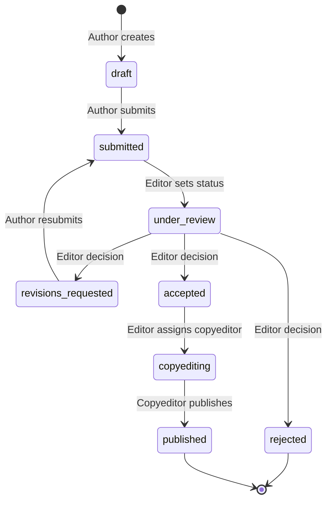

# Folio — Feature Report by Role

> [!NOTE]
> Folio is a scholarly **manuscript submission and peer-review** workspace (OJS-inspired). Single-journal MVP. Stack: **Next.js 16** + **NestJS 11** + **PostgreSQL** + **RabbitMQ** email microservice.

## Architecture at a Glance

- **Frontend:** Next.js 16 (App Router), React 19, Tailwind 4, TipTap, Radix UI, `next-intl` (EN / AR + RTL)
- **Backend:** NestJS 11, TypeORM, PostgreSQL, Passport JWT, RBAC guards, Swagger (`/api-docs`)
- **Email Service:** Standalone NestJS app — RabbitMQ consumer, Handlebars templates, SMTP / noop, cron scheduler
- **Shared:** `packages/shared/` — typed event contracts + RabbitMQ topology helpers
- **Infra:** RabbitMQ topic exchange `folio.events`, transactional outbox pattern, Docker Compose (local dev)

---

## Roles & Features

### 1. Author
- Register / login; update profile (`preferredLocale`, ORCID, affiliation, `willingToReview`)
- Create manuscript **drafts** with rich metadata (title, abstract, article type, keywords, declarations, bilingual fields)
- Use the **Word Constructor** (TipTap) to build a structured document section-by-section, then export as a styled **`.docx`** file (profile: `damascus-university-journal-v1`)
- Upload files by kind (`cover_letter`, `title_page`, `manuscript`, `figure`, …); download or delete own files
- **Submit** draft to the editorial queue
- Resubmit after *revisions requested* decisions

### 2. Editor
- View the full **submission queue** with status filters
- Change submission **status** (`submitted → under_review → accepted / rejected / revisions_requested → published`)
- Set **review method** per submission (single-blind, double-blind, open)
- **Assign reviewers** from `willingToReview` candidates; optionally pass `X-Folio-Locale` to localise the invite email
- Read all **reviews** (including confidential editor-only feedback)
- Move accepted submissions to the **public catalog**
- Invite other editors via the **RoleInvitation** flow (consent-based, no self-elevation)
- Manage **email templates** (`reviewer-invited`, `reminder-due`) per locale via admin UI
- View / edit **reminder policy** (due-soon / overdue thresholds)
- Monitor **email pipeline status** (outbox depth, email log, reminder queue, RabbitMQ queue depths)
- Preview rendered email templates before saving

### 3. Reviewer
- View **pending assignments** (`invited` status)
- **Accept or decline** an assignment; file access is granted only after acceptance
- Download submission files (manuscript stage)
- Submit a **review**: author-facing comments, confidential editor feedback, and a final recommendation (`accept` / `reject` / `revisions`)
- Receive **email reminders** automatically (due-soon + overdue) scheduled at invite time

### 4. Copyeditor
- Assigned by editor after **accepted** (`POST /submissions/:slug/copyedit-assignments`); multiple copyeditors per submission supported
- **Copyediting queue** (`GET /copyedit-assignments/me`) and workbench UI
- Send **rounds** of production queries (`POST /copyedit-assignments/:slug/notes`); author emailed (`copyedit-queries-sent`)
- Author uploads revised manuscript and marks assignment ready (`POST /copyedit-assignments/:slug/ready`); copyeditor emailed (`copyedit-author-ready`)
- **Publish** when all assignments are `ready_for_review` (`POST /submissions/:slug/publish`)

### 5. Reader (Public — unauthenticated)
- Browse the **published submissions catalog**
- View published submission detail
- Download **public manuscript files**
- Browse available **manuscript style profiles** (`GET /public/manuscript-styles`)

### 6. System / Background (no human role)
- **Outbox drainer** — polls `OutboundEvent` rows and publishes to RabbitMQ `folio.events` exchange
- **Email consumer** — `reviewer.invited`, `reminder.due`, `copyedit.assigned`, `copyedit.queries_sent`, `copyedit.author_ready`
- **Reminders scheduler** — `@Cron` every minute; publishes `reminder.due` for past-due reminders → renders + sends reminder email, updates email log
- **Health checks** — `GET /health`, `GET /health/outbox`

---

## Submission Lifecycle

Editors move a submission to `under_review` with `PATCH /submissions/:slug/status` (requires a review-package manuscript). While still `submitted`, the first reviewer **accept** can also advance status to `under_review` when that package exists — see [`API-NOTES.md`](./API-NOTES.md).

---

## Key Cross-Cutting Features

| Feature | Details |
|---|---|
| **RBAC** | Roles: `author`, `editor`, `reviewer`. Permission slugs gate every sensitive endpoint. |
| **i18n** | EN + AR (RTL). Per-user `preferredLocale`. Email locale via `X-Folio-Locale` header. |
| **DOCX export** | Constructor content → `.docx` via manuscript style profile (typography, margins, headings). |
| **Email microservice** | Decoupled via RabbitMQ; DB-backed templates editable at runtime; SMTP or noop provider. |
| **Tests** | Jest (backend unit + e2e), Vitest (frontend lib), Playwright (frontend e2e + auth cross-tab). |
