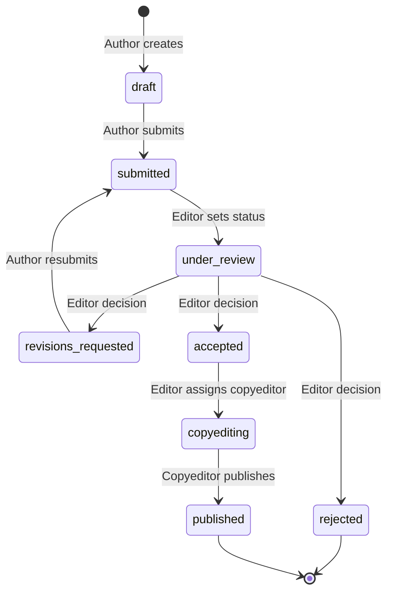

# Damascus University Journal — Feature Report by Role

> [!NOTE]
> Damascus University Journal is a scholarly **manuscript submission and peer-review** workspace (OJS-inspired). Single-journal MVP. Stack: **Next.js 16** + **NestJS 11** + **PostgreSQL** + **RabbitMQ** email microservice + optional **Python ai-service** (gRPC).

## Architecture at a Glance

- **Frontend:** Next.js 16 (App Router), React 19, Tailwind 4, TipTap, Radix UI, `next-intl` (EN / AR + RTL)
- **Backend:** NestJS 11, TypeORM, PostgreSQL, Passport JWT, RBAC guards, Swagger (`/api-docs`); BFF for AI over gRPC
- **Email Service:** Standalone NestJS app — RabbitMQ consumer, Handlebars templates, SMTP / noop, cron scheduler
- **AI Service:** Python FastAPI + gRPC — classifier, keywords, similarity, plagiarism, reviewer matching, copyedit reference check (see [`plans/ai-service.md`](./plans/ai-service.md))
- **Shared:** `packages/shared/` — typed event contracts + RabbitMQ topology helpers
- **Proto:** `proto/` — Buf contracts between Nest and ai-service
- **Infra:** RabbitMQ topic exchange `folio.events`, transactional outbox pattern, Docker Compose (local dev)

---

## Roles & Features

### 1. Author
- Register / login; update profile (`preferredLocale`, ORCID, affiliation, `willingToReview`)
- Create manuscript **drafts** with rich metadata (title, abstract, article type, keywords, declarations, bilingual fields)
- Use the **Word Constructor** (TipTap) to build a structured document section-by-section, then export as a styled **`.docx`** file (profile: `damascus-university-journal-v1`)
- Upload files by kind (`cover_letter`, `title_page`, `manuscript`, `figure`, …); download or delete own files
- **Submit** draft to the editorial queue
- Resubmit after *revisions requested* decisions, which are labelled **minor** or **major**
- Track progress on a **submission timeline**: anonymised per-reviewer state (`Reviewer 1`, `Reviewer 2`, …) with dates, revision severity, and revision round
- Download **reviewer review files** the editor has released, under an anonymised filename
- **AI-assisted (optional):** suggest Arabic discipline; LLM keyword suggestions (EN/AR); auto-classify discipline on submit when enabled

### 2. Editor
- View the full **submission queue** with status filters
- Change submission **status** (`submitted → under_review → accepted / rejected / revisions_requested`; from `accepted`, assign copyeditors → `copyediting`)
- Choose **minor** or **major** when requesting revisions (required), and pick which reviewer review files to **release to the author** with the decision
- Set **review method** per submission (single-blind, double-blind, open)
- **Assign reviewers** from `willingToReview` candidates; optionally pass `X-Folio-Locale` to localise the invite email
- **Assign copyeditors** after acceptance (`POST /submissions/:slug/copyedit-assignments`)
- Read all **reviews** (including confidential editor-only feedback)
- Invite other editors via the **RoleInvitation** flow (consent-based, no self-elevation)
- Manage **email templates** (twelve transactional keys — reviewer, copyedit, editorial, role invite) per locale via admin UI
- View / edit **reminder policy** (due-soon / overdue thresholds)
- Monitor **email pipeline status** (outbox depth, email log, reminder queue, RabbitMQ queue depths)
- Preview rendered email templates before saving
- **Search curation** (Typesense, when `TYPESENSE_ENABLED=true`): view collection status and indexed document count (`GET /editor/search/status`), view search analytics — top queries and zero-result queries (`GET /editor/search/analytics`), manage search result overrides and synonym rules
- **AI-assisted (optional):** corpus similarity report; suggested reviewers from vector matching

### 2b. Journal manager

- **User onboarding:** assign `reviewer` and `copyeditor` via `PATCH /users/:id/roles`; invite `editor` / `journal_manager` via role invitations
- **Email platform:** manage templates, reminder policy, pipeline status (same admin surfaces as editors with `email.manage_reminders`)
- **Queue oversight:** browse editor queue and submission detail (without replacing handling-editor decisions unless also an editor)
- **Search reindex:** trigger full Typesense reindex via `POST /editor/search/reindex` (requires `users.manage_roles`)
- **Audit log:** query request audit trail at `GET /audit/logs` (requires `audit.log.view` permission); filters by user, date range, HTTP method, route, action type, resource

### 3. Reviewer
- View **pending assignments** (`invited` status)
- **Accept or decline** an assignment; file access is granted only after acceptance
- Download submission files in the **review package** only (`file_stage = review`; granted after acceptance)
- Submit a **review**: author-facing comments, confidential editor feedback, and a final recommendation (`accept` / `minor_revisions` / `major_revisions` / `resubmit_for_review` / `resubmit_elsewhere` / `reject` / `see_comments`)
- Attach a **review file** (annotated manuscript or notes, PDF/DOCX) to the assignment, and withdraw it before an editor releases it
- Receive **email reminders** automatically (due-soon + overdue) scheduled at invite time
- **AI-assisted (optional):** view corpus similarity on assigned submissions (when enabled)

### 4. Copyeditor
- Assigned by editor after **accepted** (`POST /submissions/:slug/copyedit-assignments`); multiple copyeditors per submission supported
- **Copyediting queue** (`GET /copyedit-assignments/me`) and workbench UI
- Send **rounds** of production queries (`POST /copyedit-assignments/:slug/notes`); author emailed (`copyedit-queries-sent`)
- Author uploads revised manuscript and marks assignment ready (`POST /copyedit-assignments/:slug/ready`); copyeditor emailed (`copyedit-author-ready`)
- **Publish** when all assignments are `ready_for_review` (`POST /submissions/:slug/publish`)
- **AI-assisted analysis (optional):** run format, grammar (LanguageTool), and reference cross-check (LLM via `CopyeditService`) from the copyedit workbench (`POST /copyedit-assignments/:slug/ai-analysis`)

### 5. Reader (Public — unauthenticated)
- Browse the **published submissions catalog**
- View published submission detail
- Download **public manuscript files**
- Browse available **manuscript style profiles** (`GET /public/manuscript-styles`)
- **Catalog search:** keyword (FTS) or semantic (`searchMode=semantic` when AI similarity is enabled)
- **Author filter typeahead** (`GET /public/submissions/author-suggestions`)
- **Related articles** on publication detail when similarity index is populated

### 6. System / Background (no human role)
- **Outbox drainer** — polls `OutboundEvent` rows and publishes to RabbitMQ `folio.events` exchange
- **Email consumer** — `reviewer.invited`, `reminder.due`, copyedit events (`copyedit.assigned`, `copyedit.queries_sent`, `copyedit.author_ready`), editorial events (`submission.submitted`, `submission.decision`, `submission.published`), review events (`review.submitted`, `review.invitation_accepted`, `review.invitation_declined`), `role.invitation`
- **Reminders scheduler** — `@Cron` every minute; publishes `reminder.due` for past-due reminders → renders + sends reminder email, updates email log
- **Typesense sync** — `SearchSyncService` bootstraps on startup and runs incremental syncs every 5 minutes (checkpoint-based); upserts published submissions, removes unpublished ones. Analytics rules (popular-queries, nohits-queries) ensured on bootstrap. Reader click events recorded via `POST /public/search/click` (fire-and-forget)
- **Audit middleware** — records every non-health request to `audit_log` (user, IP, method, path, status, duration, request body with sensitive fields redacted). Sampled at `AUDIT_SAMPLE_RATE` (default 1.0)
- **Health checks** — `GET /health`, `GET /health/outbox`; email-service: `GET /health` (liveness), `GET /ready` (readiness)

---

## Submission Lifecycle

```mermaid
stateDiagram-v2
    [*] --> draft : Author creates
    draft --> submitted : Author submits
    submitted --> under_review : Editor sets status
    under_review --> revisions_requested : Editor decision
    revisions_requested --> submitted : Author resubmits
    under_review --> rejected : Editor decision
    under_review --> accepted : Editor decision
    accepted --> copyediting : Editor assigns copyeditor
    copyediting --> published : Copyeditor publishes
    rejected --> [*]
    published --> [*]
```

Editors move a submission to `under_review` with `PATCH /submissions/:slug/status` (requires a review-package manuscript). While still `submitted`, the first reviewer **accept** can also advance status to `under_review` when that package exists — see [`API-NOTES.md`](./API-NOTES.md).

---

## Key Cross-Cutting Features

| Feature | Details |
|---|---|
| **RBAC** | Roles: `author`, `editor`, `journal_manager`, `reviewer`, `copyeditor`. Permission slugs gate every sensitive endpoint. |
| **i18n** | EN + AR (RTL). Per-user `preferredLocale`. Email locale via `X-Folio-Locale` header. |
| **DOCX export** | Constructor content → `.docx` via manuscript style profile (typography, margins, headings). |
| **Email microservice** | Decoupled via RabbitMQ; DB-backed templates editable at runtime; SMTP or noop provider. |
| **AI microservice** | Optional gRPC features: discipline, keywords, similarity, plagiarism/corpus, reviewer matching, copyedit reference cross-check — toggled per env (see [`plans/ai-service.md`](./plans/ai-service.md)). Copyedit grammar uses LanguageTool (Nest HTTP, Docker in `docker-compose.dev.yml`). |
| **Typesense search** | Optional full-text search for publication catalog (`TYPESENSE_ENABLED=true`). Weighted multi-field matching, typo tolerance, prefix search, facets. Background incremental sync. Editor curation API: overrides, synonyms, analytics. |
| **ORCID OAuth** | Optional `ORCID_ENABLED=true` — Sign in with ORCID and account linking. Sandbox and production ORCID endpoints supported. |
| **Audit log** | Every API request sampled at `AUDIT_SAMPLE_RATE` and stored in `audit_log` with user, IP, method, path, status, duration, action/resource classification. Queryable by journal managers with `audit.log.view`. |
| **In-app notifications** | REST inbox + SSE live updates (header bell); copyedit, review, and editorial events. See [`API-NOTES.md`](./API-NOTES.md) § In-app notifications. |
| **Tests** | Jest (backend unit + e2e), Vitest (frontend lib), Playwright (frontend e2e + auth cross-tab), pytest (ai-service). |
