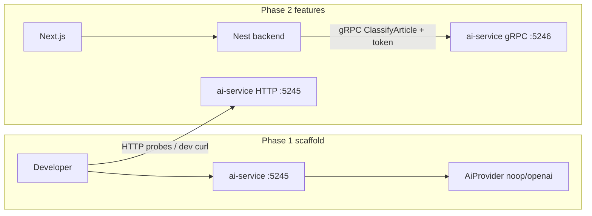

# AI service — design record

Python **FastAPI** microservice for Folio AI features. Phase 1 includes health, config validation, provider registry, and an optional **AraBERT discipline classifier** (dev verification API). Product routes and Nest/frontend integration are deferred to phase 2.

Informal stack context: [`docs/PROJECT-CONTEXT.md`](../PROJECT-CONTEXT.md). Runbook: [`services/ai-service/README.md`](../../services/ai-service/README.md).

## Why a separate service

1. **Python ecosystem** — LLM SDKs, embeddings, and ML tooling are strongest in Python; keeps the Nest API focused on peer-review domain logic.
2. **Secret isolation** — `OPENAI_API_KEY` and similar credentials live only in this service, not in the main API or browser.
3. **Independent scaling** — AI workloads can be scaled or throttled separately from the HTTP API.

## High-level architecture



## Repository layout

| Path | Purpose |
|------|---------|
| [`proto/`](../../proto) | Buf module + `ClassifierService` contract |
| [`services/ai-service/`](../../services/ai-service) | FastAPI app, gRPC server, providers, tests, Dockerfile |
| [`services/ai-service/app/config.py`](../../services/ai-service/app/config.py) | `pydantic-settings` + production validation |
| [`services/ai-service/app/providers/`](../../services/ai-service/app/providers) | `noop`, `openai` registry |
| [`docs/plans/ai-service.md`](./ai-service.md) | This design record |

No `packages/shared` mirror yet — event contracts are unnecessary until async jobs exist.

## Ports and probes

| Endpoint | Port | Role |
|----------|------|------|
| HTTP API | `5245` (`PORT`) | Uvicorn — health, readiness, `GET /v1/status` |
| gRPC | `5246` (`GRPC_PORT`) | Nest `AiClientService` — all product RPCs (classify, keywords, plagiarism, similarity) |
| `GET /health` | 5245 | Liveness |
| `GET /ready` | 5245 | Readiness (`checks.provider`) |

Aligns with the email-service health JSON shape (`status`, `checks`).

## Configuration

See [`services/ai-service/.env.example`](../../services/ai-service/.env.example).

| Variable | Notes |
|----------|-------|
| `APP_ENV` | `development` \| `production`; also accepts legacy `NODE_ENV` when unset |
| `AI_PROVIDER` | `noop` (dev default) \| `openai` |
| `OPENAI_API_KEY` | Required for `openai` in production or `RUNTIME_CONFIG_STRICT=true` |
| `OPENAI_BASE_URL` | Optional OpenAI-compatible gateway |
| `RUNTIME_CONFIG_STRICT` | Force production validation locally |
| `ARABERT_ENABLED` | `false` by default; enable gRPC `ClassifierService` locally |
| `ARABERT_MODEL_PATH` | Override weights directory |
| `GRPC_PORT` | gRPC listen port (default `5246`) |
| `AI_SERVICE_TOKEN` | When set, required on gRPC metadata (`x-folio-service-token`) |

Production rules (mirror email-service strictness):

- `AI_PROVIDER=noop` is rejected.
- `AI_PROVIDER=openai` requires a non-placeholder `OPENAI_API_KEY`.

## Arabic discipline classifier (AraBERT)

Fine-tuned `BertForSequenceClassification` over 10 Arabic discipline labels (see weights `config.json`).

| Item | Location |
|------|----------|
| Inference module | [`app/ml/arabic_classifier.py`](../../services/ai-service/app/ml/arabic_classifier.py) |
| Path resolution | [`app/ml/paths.py`](../../services/ai-service/app/ml/paths.py) |
| gRPC (dev) | `ClassifierService` when `ARABERT_ENABLED=true` |
| Notebook | [`classify.ipynb`](../../services/ai-service/classify.ipynb) |
| ML extra | `pip install -e ".[ml]"` (torch, transformers, arabert) |

Weights stay on disk under the nested export folder or `ARABERT_MODEL_PATH`; they are gitignored. `/ready` checks `config.json` exists when enabled (no weight load). CI runs fast tests only; `RUN_ML_TESTS=1 pytest -m ml` for local integration.

## Provider layer

```text
AiProvider.ping() -> bool   # used by /ready
```

- **noop** — always ready; no outbound calls.
- **openai** — `AsyncOpenAI` client; scaffold `ping()` checks key presence only (no billed API call).

## Nest BFF integration (discipline MVP)

Implemented in the Nest backend (author + editor, first PR):

| Route | Who | Purpose |
|-------|-----|---------|
| `POST /submissions/:slug/suggest-discipline` | Author (draft) | Call ai-service, store `disciplineSuggested*` |
| `POST /submissions/:slug/suggest-keywords` | Author (draft) | Call ai-service `KeywordService.SuggestKeywords` (gRPC); return lists only (no persist) |
| `POST /submissions/suggest-keywords-preview` | Author (new wizard) | Same gRPC call with title/abstract in request body (no slug) |
| `PATCH /submissions/:slug/discipline` | Author only | Confirm / override `discipline` |
| `GET /submissions/discipline-labels` | Author / editor | Label list + optional journal scope |

Author keyword suggestions use **gRPC** (`AI_KEYWORDS_ENABLED` + `AI_SERVICE_GRPC_HOST` on Nest; `KEYWORDS_SUGGESTION_ENABLED` + `AI_PROVIDER=openai` on ai-service). Partial results (1–2 terms) are returned; submit still requires 3–6 keywords per language.

Reader related articles and catalog semantic search use **gRPC** `SimilarityService` when `AI_SIMILARITY_ENABLED=true` on Nest and `SIMILARITY_ENABLED=true` on ai-service.

On **submit**, Nest classifies via **gRPC** when `AI_SERVICE_ENABLED=true` and `AI_SERVICE_GRPC_HOST` is set (Arabic-first metadata). See [`backend/.env.example`](../../backend/.env.example) and [`proto/README.md`](../../proto/README.md).

## Phase 2 — further integration (planned)

1. ~~Optional `X-Folio-Service-Token` validation on ai-service.~~ **Done** — gRPC interceptor when `AI_SERVICE_TOKEN` is set.
2. Redact manuscript text in Nest logs (see email-service redactor patterns).
3. Reviewer read-only discipline context.
4. gRPC server streaming for LLM tokens (separate proto RPC).

**RabbitMQ** is optional later for jobs that exceed HTTP timeouts; not required for interactive UI features.

## Docker Compose (deferred)

[`docker-compose.dev.yml`](../../docker-compose.dev.yml) currently runs RabbitMQ only. The ai-service runs on the host in dev (same as email-service). A future compose service block:

```yaml
# ai-service:
#   build: ./services/ai-service
#   ports: ["5245:5245"]
#   env_file: ./services/ai-service/.env
```

## Security notes

- Do not expose this service directly to browsers.
- Do not log full prompts or manuscript bodies without redaction.
- Rate-limit at the Nest layer using existing throttler profiles when adding product routes.
