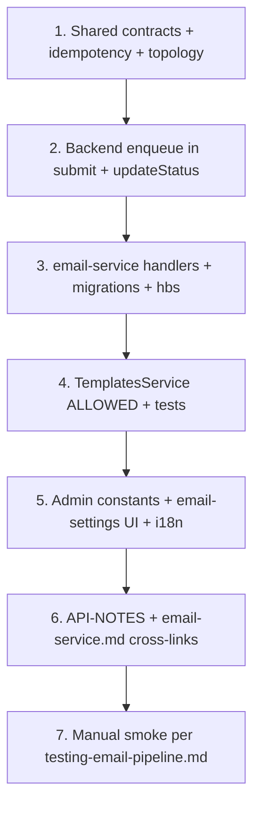

# Email Phase 2 — event plan (submission & decisions)

**Status:** Implemented (see commit / codebase). This document remains the design record.  
**Companion:** [`email-service.md`](./email-service.md) (v1 pipeline), [`../API-NOTES.md`](../API-NOTES.md) § Phase 2.

This document defines the **next** transactional emails after v1 (reviewer invite, reminders, copyedit). It follows the same patterns: transactional outbox in the backend, RabbitMQ `folio.events`, dedicated queues in `email-service`, `email_log` idempotency, Handlebars templates in `email.email_template`, and optional admin editing under `email.manage_reminders`.

---

## Goals (v2.0 scope)

| # | User story | Trigger | Recipient |
|---|------------|---------|-----------|
| 1 | Editor learns a manuscript was submitted (or resubmitted) | Author `POST …/submit` | Every user with the **editor** role |
| 2 | Author learns the editor’s decision | Editor `PATCH …/status` → `revisions_requested`, `accepted`, or `rejected` | Submission **author** |

**Explicitly out of v2.0** (track as v2.1+):

- Review submitted → notify editor (`review.submitted`)
- Published → notify author (`submission.published`)
- Editor role invitation email (`role.invitation`) — today in-app only
- `under_review` transition email to author (often set automatically when a reviewer accepts)
- Password reset / registration welcome

---

## Design principles (inherit from v1)

1. **Outbox + same transaction** as the domain write (`submit`, `updateStatus`).
2. **One Rabbit message → one primary recipient** (same as copyedit). For multiple editors, the backend enqueues **one outbox row per editor** inside the same transaction (batch insert), not one message with an array (keeps handlers simple and idempotency obvious).
3. **`idempotencyKey`** on the event; consumer pre-claims `email_log` with `ON CONFLICT DO NOTHING`.
4. **`emailLocale`** on the event: `recipient.preferred_locale` → `X-Folio-Locale` (when the acting user is an editor) → `DEFAULT_EMAIL_LOCALE` → `en`.
5. **Links** built with `APP_BASE_URL` + existing frontend routes.
6. **Mirrors:** update `packages/shared/contracts/email-events.ts`, then backend + email-service mirrors, `packages/shared/messaging/idempotency.ts`, `topology.ts`.

---

## Event 1 — `SubmissionSubmitted`

### When to publish

| Call site | Condition |
|-----------|-----------|
| `SubmissionsService.submit()` | After successful save, status becomes `submitted` |

Set `isResubmission: true` when the previous status was `revisions_requested` (author sent revisions). First-time submit: `isResubmission: false`.

Do **not** publish on draft saves, file uploads, or constructor-only actions.

### Recipients

All users with role slug `editor` (same cohort that can see the editor queue via `submission.view_editor_queue`).

**Query (conceptual):** distinct users joined to `user_roles` → `roles` where `roles.slug = 'editor'`, with `id`, `email`, `displayName`, `preferred_locale`.

**v2.0 journal model:** one journal, broadcast to all editors.  
**Future:** if Folio gains per-journal staff, replace broadcast with journal-scoped recipients.

### Routing & type

| Field | Value |
|-------|--------|
| Routing key | `submission.submitted` |
| Queue | `email.submission_submitted` |
| DLX routing key | `submission.submitted.dead` |
| Event `type` | `SubmissionSubmitted` |

### Idempotency

Per editor per submission (and resubmission is a **new** submit — new keys are fine):

```
submission_submitted:{submissionSlug}:{editorUserId}
```

If `submit()` is retried and the transaction replays, duplicate keys dedupe. If the author submits twice from `revisions_requested` twice without editor action, two waves of mail are **correct** (two resubmissions).

### Payload (draft)

```ts
export type SubmissionSubmittedEvent = {
  type: 'SubmissionSubmitted';
  occurredAt: string; // ISO
  idempotencyKey: string;
  submissionSlug: string;
  submissionTitle: string;
  isResubmission: boolean;
  emailLocale?: 'en' | 'ar';
  author: AuthorIdentity;
  editor: EditorIdentity; // recipient
  editorQueueUrl: string; // e.g. {APP_BASE_URL}/submissions/{slug} or /editor
};
```

**Template key:** `submission-submitted`  
**Suggested subject:** `{{#if isResubmission}}Revised manuscript submitted{{else}}New submission received{{/if}}: {{submissionTitle}}`

**Variables:** `authorDisplayName`, `submissionTitle`, `submissionSlug`, `isResubmission`, `editorQueueUrl`

---

## Event 2 — `SubmissionDecision`

### When to publish

| Call site | Condition |
|-----------|-----------|
| `SubmissionsService.updateStatus()` | After save, `next` ∈ `{ revisions_requested, accepted, rejected }` |

Do **not** publish for: `under_review`, `copyediting`, `published`, or no-op transitions.  
`published` is a separate product moment (copyeditor path) — defer to v2.1.

### Recipient

Submission author only (`submission.author`).

### Routing & type

| Field | Value |
|-------|--------|
| Routing key | `submission.decision` |
| Queue | `email.submission_decision` |
| DLX routing key | `submission.decision.dead` |
| Event `type` | `SubmissionDecision` |

### Idempotency

Keyed by target status so repeat PATCH to the same status does not double-send (if the API ever allows idempotent retries):

```
submission_decision:{submissionSlug}:{decision}
```

where `decision` is `revisions_requested` | `accepted` | `rejected`.

If the workflow later allows `accepted` → `revisions_requested`, a new decision value gets a new key (intended).

### Payload (draft)

```ts
export type SubmissionDecisionKind =
  | 'revisions_requested'
  | 'accepted'
  | 'rejected';

export type SubmissionDecisionEvent = {
  type: 'SubmissionDecision';
  occurredAt: string;
  idempotencyKey: string;
  submissionSlug: string;
  submissionTitle: string;
  decision: SubmissionDecisionKind;
  emailLocale?: 'en' | 'ar';
  author: AuthorIdentity;
  decidedBy: EditorIdentity;
  submissionUrl: string; // author-facing detail page
};
```

**Template key:** `submission-decision` (single template; branch on `decision` like `reminder-due` / `isOverdue`)

**Variables:** `authorDisplayName`, `submissionTitle`, `decision`, `submissionUrl`, `decidedByDisplayName`

**v2.0 limitation:** `updateStatus` does not accept editor comments. Templates cannot include decision rationale until the API carries an optional `messageForAuthor` (v2.1).

---

## Publisher changes (backend)

### `submit()`

1. Wrap in `submissionsRepo.manager.transaction` (if not already).
2. Save submission with `status = submitted`.
3. Load editor list.
4. For each editor: `eventPublisher.enqueue(ROUTING_KEY.submissionSubmitted, payload, em)`.

### `updateStatus()`

1. Wrap status change + enqueue in one transaction.
2. If `next` is a decision status, build `SubmissionDecisionEvent` and `enqueue` once (single recipient).

### Helper

Extract `enqueueSubmissionSubmittedForEditors(submission, author, editorActorLocale?, em)` and `enqueueSubmissionDecision(submission, author, editor, decision, em)` next to existing `enqueueReviewerInvitedEvent` in `submissions.service.ts`.

Pass `X-Folio-Locale` from controller on `PATCH …/status` (mirror `assignReviewer`).

---

## Consumer changes (email-service)

| Handler | Template | Notes |
|---------|----------|--------|
| `SubmissionSubmittedHandler` | `submission-submitted` | Same pre-claim → render → `provider.send` as copyedit util |
| `SubmissionDecisionHandler` | `submission-decision` | No reminder side effects |

Register in `ConsumersService` + `handlers.module.ts`.

Extend `TemplatesService.ALLOWED` and `FILE_FALLBACK` when implementing (lesson from copyedit v1).

---

## RabbitMQ topology delta

Add to `packages/shared/messaging/topology.ts` (and mirrors):

| Queue | Binding key |
|-------|-------------|
| `email.submission_submitted` | `submission.submitted` |
| `email.submission_decision` | `submission.decision` |

Update `RabbitMqQueueMetricsService` / pipeline-status queue list in backend admin.

---

## Database / templates

1. Migration: extend `ck_email_template_key` CHECK with `submission-submitted`, `submission-decision`.
2. Seed `en` rows from new `.hbs` files under `services/email-service/templates/`.
3. Optional migration: Arabic default copy (pattern `1714600000003-ar-email-template-default-copy.ts`).

No new reminder policy rows.

---

## Admin API & UI

| Artifact | Change |
|----------|--------|
| `admin-email.constants.ts` | Add two template keys |
| `PREVIEW_CONTEXT` | Sample author/editor names + URLs |
| `email-settings` page | Two sections under new heading “Editorial workflow” (or split Author / Editor) |
| `docs/testing-email-pipeline.md` | Document new routing keys |

Preview endpoints already generic: `POST /admin/email/templates/:key/preview`.

---

## Implementation order (recommended)



**Tests to add:**

- Backend unit: `submit` enqueues N outbox rows for N editors; `updateStatus` enqueues one decision row.
- email-service unit: handlers idempotency + template render.
- Optional e2e: assign editor + author submit with `EMAIL_PROVIDER=noop` and assert `email_log` rows.

---

## Open decisions (confirm before build)

| # | Question | Recommendation |
|---|----------|----------------|
| 1 | Editor queue link in email? | `{APP_BASE_URL}/submissions/{slug}` (editor can open from queue) |
| 2 | Separate templates for resubmission vs first submit? | Single template + `isResubmission` flag |
| 3 | Email on `under_review`? | Defer (v2.1) — avoids noise when reviewer accept auto-transitions |
| 4 | Decision email when editor sets `accepted` then author never sees copyedit? | Still send on `accepted`; copyedit is a later status |
| 5 | Rate limit / max editors? | v2.0: no cap (expect small editor pool). Revisit for multi-tenant |

---

## Docs to update when implemented

- [`../API-NOTES.md`](../API-NOTES.md) — Phase 2 bullet + event table rows
- [`./email-service.md`](./email-service.md) — architecture diagram + topology table
- [`../testing-email-pipeline.md`](../testing-email-pipeline.md) — admin template list + smoke steps

---

## Summary table (full event catalog after Phase 2)

| Routing key | Producer | Recipient | Template |
|-------------|----------|-----------|----------|
| `reviewer.invited` | backend | reviewer | `reviewer-invited` |
| `reminder.due` | email-service cron | reviewer | `reminder-due` |
| `copyedit.assigned` | backend | copyeditor | `copyedit-assigned` |
| `copyedit.queries_sent` | backend | author | `copyedit-queries-sent` |
| `copyedit.author_ready` | backend | copyeditor | `copyedit-author-ready` |
| **`submission.submitted`** | **backend** | **each editor** | **`submission-submitted`** |
| **`submission.decision`** | **backend** | **author** | **`submission-decision`** |
