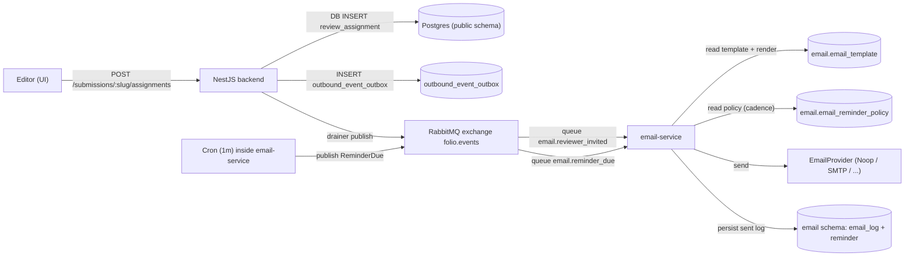

# Email service — design record

This file captures the implemented design of the email microservice
that owns all outbound mail in Folio (immediate reviewer-invite emails
and scheduled reminders). It mirrors the executed plan and the trade-offs
made along the way. Companion plan: `.cursor/plans/email-microservice-with-rabbitmq_*.plan.md`.

Informal end-to-end walkthrough (may lag this doc): [`email-details.md`](../../email-details.md) at repo root.

## Why a separate service

The Nest backend is a modular monolith ([`PROJECT-CONTEXT.md`](../PROJECT-CONTEXT.md)). Two
forces tipped this domain over into a dedicated service:

1. **Scheduled work.** Reminders need a clock-driven loop that should
   not contend with HTTP request latency or be tied to API uptime.
2. **Outbound IO.** SMTP/transactional providers have their own failure
   modes (timeouts, throttling, deliverability). Owning the provider
   retry surface and **DLQ path** (`basicNack(requeue=false)` → dead-letter
   exchange) in one isolated process keeps the API simple.

Both fit the "extract a small service later only if needed" criterion
in [`docs/PROJECT-CONTEXT.md`](../PROJECT-CONTEXT.md). The first piece extracted is `email-service`.

## High-level architecture



## Repository layout

| Path | Purpose |
|------|---------|
| [`packages/shared/contracts/email-events.ts`](../../packages/shared/contracts/email-events.ts) | Canonical TypeScript event types (`ReviewerInvitedEvent`, `ReminderDueEvent`). |
| [`packages/shared/messaging/`](../../packages/shared/messaging) | Canonical `assertTopology`, `redactEventPayload`, idempotency-key builders. |
| [`backend/src/messaging/contracts/`](../../backend/src/messaging/contracts) | Mirror of the contracts (kept in sync). |
| [`backend/src/messaging/shared/`](../../backend/src/messaging/shared) | Mirror of the messaging helpers. |
| [`backend/src/messaging/`](../../backend/src/messaging) | `MessagingModule`: `RabbitMqConnection`, `EventPublisherService`, `OutboxDrainerService`, `OutboxHealthController`. |
| [`backend/src/entities/outbound-event.entity.ts`](../../backend/src/entities/outbound-event.entity.ts) | `outbound_event_outbox` row. |
| [`services/email-service/`](../../services/email-service) | Nest standalone app: AMQP consumer, templates, providers, reminders cron, email_log state machine. |
| [`docker-compose.dev.yml`](../../docker-compose.dev.yml) | Local RabbitMQ for development. |

The "canonical + mirror" pattern matches the existing convention used
for [`constructor-content.types.ts`](../../backend/src/submissions/constructor-content.types.ts)
between backend and frontend. `packages/shared/` is the documented
source of truth; mirrors live inside each app's `src/` so neither
app's `tsc` rootDir crosses package boundaries.

## RabbitMQ topology

Asserted idempotently by both apps on startup via `assertTopology()`.

| Object | Name | Type / args |
|--------|------|-------------|
| Exchange | `folio.events` | topic, durable |
| DLX | `folio.events.dlx` | topic, durable |
| Queue | `email.reviewer_invited` | durable, DLX = `folio.events.dlx`, DLR-key = `reviewer.invited.dead` |
| Queue | `email.reminder_due` | durable, DLX = `folio.events.dlx`, DLR-key = `reminder.due.dead` |
| Queue | `folio.events.dlq` | durable, bound to `folio.events.dlx` with binding key `#` |
| Binding | `email.reviewer_invited` | bound to `folio.events` with key `reviewer.invited` |
| Binding | `email.reminder_due` | bound to `folio.events` with key `reminder.due` |

Choosing **topic exchange + explicit bindings** instead of
`@nestjs/microservices`'s built-in RMQ transport: the latter wires a
single queue per service in a request/reply pattern, which fights
against fanning out events with different routing keys. We use
`amqplib` directly, wrapped in a thin Nest service.

## Event contracts

Canonical: [`packages/shared/contracts/email-events.ts`](../../packages/shared/contracts/email-events.ts).

```ts
type ReviewerInvitedEvent = {
  type: 'ReviewerInvited';
  occurredAt: string;
  idempotencyKey: string;     // "reviewer_invited:" + assignmentSlug
  assignmentSlug: string;
  submissionSlug: string;
  submissionTitle: string;
  reviewer:  { id; email; displayName };
  invitedBy: { id; displayName };
  acceptUrl: string;
  declineUrl: string;
};

type ReminderDueEvent = {
  type: 'ReminderDue';
  occurredAt: string;
  idempotencyKey: string;     // "reminder_due:" + reminderId
  reminderId: string;
  kind: 'review_due_soon' | 'review_overdue';
  assignmentSlug: string;
  reviewer: { id; email; displayName };
  dueAt: string;
};
```

`idempotencyKey` is the unique key on `email_log`; see "State machine"
below for how it powers dedupe + crash recovery.

## Backend: publisher with transactional outbox

`POST /submissions/:slug/assignments` creates a `ReviewAssignment` row and
an `outbound_event_outbox` row in the **same database transaction**:
`SubmissionsService.assignReviewer` saves the assignment and calls
`EventPublisherService.enqueue("reviewer.invited", payload, entityManager)`
so either both commit or neither does. A **failed** outbox insert (or any
error inside that transaction) surfaces as an HTTP error and **no**
assignment row remains.

`OutboxDrainerService` runs every 10s and publishes pending rows to
RabbitMQ:

- Successes flip `status='published'`.
- On publish failure, the drainer increments `attempts`, then sets
  `nextAttemptAt = now() + min(60_000 * 2 ** attempts, 1h)` (so the **first**
  reschedule is **120s** after the first failure, not 60s). After 8 failed
  attempts the row becomes `status='dead'`.
- Dead rows surface via `GET /api/v1/health/outbox` (counts only, no
  PII).

Once both rows exist, a **broker outage** does not lose the event: the
outbox row stays `pending` until the drainer can publish. That is separate
from a **DB transaction failure** before commit, which fails the API and
rolls back the assignment.

## Email-service: handler state machine (plan §6)

Lives in
[`services/email-service/src/handlers/reviewer-invited.handler.ts`](../../services/email-service/src/handlers/reviewer-invited.handler.ts)
and
[`services/email-service/src/handlers/reminder-due.handler.ts`](../../services/email-service/src/handlers/reminder-due.handler.ts).

For **reminder** sends, after `EmailProvider.send()` succeeds, the
`email_log` “sent” update and the `reminder` “sent” update run in **one**
Postgres transaction so the two rows do not diverge if the process stops
mid-flight.

1. **Pre-claim:** raw `INSERT INTO email_log (..., status='pending') ON CONFLICT (idempotency_key) DO NOTHING`.
   - **1 row inserted** → first delivery. Continue.
   - **0 rows inserted** → row already exists. Load it, then branch:
     - `pending` → first delivery committed steps 1–3 but the worker
       died before sending. Skip reminder creation, jump to send.
     - `failed` → broker is redelivering a previous failure. Retry
       provider call.
     - `sent` → true duplicate. Ack and return.
2. Insert `Reminder` rows in the same transaction. Two per invite:
   - `kind='review_due_soon'` at `now() + (REVIEW_DUE_IN_DAYS - 3) days`.
   - `kind='review_overdue'` at `now() + (REVIEW_DUE_IN_DAYS + 1) days`.
3. Commit. The pre-claim row guarantees a concurrent redelivery loses
   the race at step 1.
4. Render Handlebars template + call `EmailProvider.send()` outside
   the transaction.
5. **Success** → `UPDATE email_log SET status='sent', sent_at=now() WHERE id=$1 AND status IN ('pending','failed')`.
   The status guard prevents two workers from racing the same row —
   the loser sees `affected=0` and acks. For **`reminder.due`**, the
   matching `UPDATE` on `reminder` (status `sent`) runs in the **same**
   DB transaction as the `email_log` update so the two cannot diverge.
6. **Failure** → `UPDATE email_log SET status='failed'` and
   `basicNack(requeue=false)` so RabbitMQ **does not requeue** the
   message; it is dead-lettered to `folio.events.dlx` and lands in the
   DLQ bound there. Operators may **replay** from the DLQ or republish
   after fixing the root cause. If the broker redelivers a copy, the
   handler sees `status='failed'` and **retries the provider call**
   without re-creating reminders (this is application-level retry, not
   automatic AMQP requeue).

This ordering avoids the "0 rows ⇒ always ack" bug: a crash between
commit and send leaves a `pending` row that a redelivery resumes.

## Reminder lifecycle

The email-service is the **single owner** of `Reminder` rows. The
backend never inserts them (except admin SQL); editors reschedule or cancel **pending** rows via `email.manage_reminders` APIs.

### Global cadence (`email.email_reminder_policy`)

The singleton row (`id = 1`) stores **`review_due_in_days`** (must be **> 3** in DB; API/UI enforce minimum **4**). From invitation time, reminders are scheduled at **(N−3)** days (due-soon) and **(N+1)** days (overdue), matching the previous env-only behaviour (`REVIEW_DUE_IN_DAYS`). Editors update this via **`PATCH /api/v1/admin/email/reminder-policy`** with optimistic locking (`expectedUpdatedAt`). If env **`REVIEW_DUE_IN_DAYS`** is still set, email-service falls back when the policy row is missing (development).

Changing policy **does not** reschedule existing **pending** reminders; only **new** reviewer invitations pick up the new offsets.

### Templates (`email.email_template`)

Bodies and subjects are stored per **`(template_key, locale)`** with `locale` in **`en` \| `ar`**. The email-service loads the matching row **from the DB on each render** (no long-lived cache) so edits apply on the next send. If the resolved locale row is missing, rendering falls back to the **`en`** row for that key, then disk files under `templates/` as a last resort (dev / pre-migration).

Editors manage templates via **`GET/PATCH /api/v1/admin/email/templates/:templateKey?locale=en|ar`** (same permission). **`POST .../preview?locale=...`** renders with a **fixed server-side demo context** (no outbound mail).

### Outbound locale resolution (backend publisher)

When an editor assigns a reviewer, the backend resolves **`emailLocale`** with priority: recipient **`users.preferred_locale`** → request header **`X-Folio-Locale`** (editor UI hint) → **`DEFAULT_EMAIL_LOCALE`** env → **`en`**. The value is embedded in **`ReviewerInvited`** events and snapshotted on **`reminder.email_locale`** so scheduled reminders stay consistent if the user later changes preference.

**Trust:** template content is Handlebars; only trusted editors should edit. Validate with compile checks before save.

`RemindersScheduler` runs `@Cron(EVERY_MINUTE)`, picks `Reminder` rows
where `status='pending' AND sendAt <= now()`, and publishes a
`reminder.due` event back through the broker. The same handler path
(template render + provider send + DLQ via `nack(requeue=false)` as
above) processes both immediate sends and scheduled reminders — one
place to debug.

v1 stale-reminder fallback: the `reminder.due` handler refuses to send
if the corresponding `Reminder` row is no longer `pending`. (A v2
`ReviewerResponded` event will mark these `cancelled` proactively
when an assignment is accepted/declined/completed; v1 simply drops
them at handler time.)

## Migrations & schema isolation

The email-service owns its own TypeORM datasource pinned to the
`email` Postgres schema (see
[`services/email-service/src/db/data-source.ts`](../../services/email-service/src/db/data-source.ts)).

- `email-service` migrations: `npm run migrate` (uses TypeORM CLI).
  The bootstrap path also runs `runMigrations()` on startup so a fresh
  database becomes usable without any manual step. Migrations create
  `email.email_template` and `email.email_reminder_policy` (with seeds from
  the default files). **Deploy order:** run **email-service migrations first**
  (or start email-service once) so these tables exist before the backend
  or workers rely on them.
- Backend datasource is unchanged (`synchronize: true` against
  `public`). The backend **reads** `email.*` admin tables via raw SQL
  for editor APIs; it does not run email-service migrations.

If the backend connects as a **restricted** Postgres role (not the table owner),
run [`backend/scripts/grant-email-reminder-admin.sql`](../../backend/scripts/grant-email-reminder-admin.sql)
after email-service migrations so `SELECT`/`UPDATE` on `email.reminder`,
`email.email_template`, and `email.email_reminder_policy` succeed for `DB_USERNAME`.

The backend's `outbound_event_outbox` table lives in `public` because
it must commit atomically with `review_assignments`.

### Rollout (Section 7): dev vs production

**Development / pre-production:** You can reset the database or wipe queues. Running email-service migrations (or starting email-service once, which runs migrations) plus the backend together is usually enough; no multi-phase backlog drain is required when there is no legacy queue.

**Production:** Prefer rolling schema migrations first (nullable columns or defaults, backfill Arabic template rows, etc.). **Do not deploy an updated backend publisher alone** while the active email-service consumer still ignores `emailLocale` and fails to persist `reminder.email_locale` on the reviewer-invite path — consumers could receive payloads with locale while reminders stay inconsistent. **Ship the updated consumer before or with the publisher.** After traffic stabilizes, tighten constraints (for example `NOT NULL` on `reminder.email_locale`) and optionally drop defensive handling for missing `emailLocale` on the wire.

**Header semantics:** `X-Folio-Locale` is an editor UI locale hint for fallback resolution only; it does not grant privileges. **Resolved locale** (stored on events and reminders) is separate from **template row fallback** (if no DB row for `(templateKey, ar)`, rendering uses the `en` row for that key).

## Provider abstraction

[`services/email-service/src/providers/email-provider.ts`](../../services/email-service/src/providers/email-provider.ts)
is the single interface every concrete sender implements. Wired via a
DI factory keyed on `EMAIL_PROVIDER` (`noop` | `smtp`). Default is
`noop` so a fresh checkout never reaches an SMTP host. The SMTP
provider is a Nodemailer skeleton; replacing it with Resend / Mailgun /
SES is a one-class addition.

## PII & log retention

Personal data on the bus: `reviewer.email`, `reviewer.displayName`,
`invitedBy.displayName`. Rules enforced by the implementation:

- `email_log.context` (jsonb) is the only persistent location.
  A pruning job (>180 days) is documented as out of scope for v1.
- `redactEventPayload()` strips `reviewer` / `invitedBy` blocks
  before any payload reaches `Logger.debug` / `Logger.warn`. Mirrored
  in both apps so neither side leaks via logs.
- Same redactor applies to any future DLQ inspection tooling.

## App base URL

Used to build accept/decline links inside `ReviewerInvitedEvent`
(backend publisher) and assignment links inside reminder emails
(email-service consumer). Rules in both `.env.example` files:

- No trailing slash.
- HTTPS in staging/production.
- `http://localhost:5240` only when `NODE_ENV=development`.
- The email-service treats these URLs as opaque; multi-tenant
  separation lives in the publisher.

## Operational endpoints

- `GET /api/v1/health` — backend liveness (existing).
- `GET /api/v1/health/outbox` — outbox stats (counts of pending /
  published / dead, **dueNow** pending rows eligible to drain now,
  oldest pending row). Use this to detect a stuck drainer or a broker outage.
- **Journal email admin (editors, `email.manage_reminders`):**
  - `GET/PATCH /api/v1/admin/email/reminder-policy`
  - `GET/PATCH /api/v1/admin/email/templates/:templateKey` (keys: `reviewer-invited`, `reminder-due`; invalid key → **422**)
  - `POST /api/v1/admin/email/templates/:templateKey/preview` (no mail; fixed demo context)
- Assignments: `GET/PATCH/POST` under `submissions/.../assignments/.../reminders` (pending reminders only) — see [`testing-email-pipeline.md`](../testing-email-pipeline.md).
- RabbitMQ management UI: `http://localhost:15672` (guest/guest in dev).

## Out of scope (v1)

- Concrete email vendor selection (kept abstract).
- `ReviewerResponded` event for proactive reminder cancellation
  (handler currently re-checks `Reminder.status` before sending).
- Multi-replica reminder scheduler (single instance assumed; switch to
  `SELECT ... FOR UPDATE SKIP LOCKED` when sharding).
- Email log retention pruning job.

## Phase 2 status

This service ships the assignment-email and scheduled-reminder bullets
from [`docs/API-NOTES.md`](../API-NOTES.md) "Phase 2 (deferred)".
WebSockets/SSE for in-app notifications and refresh-token / OAuth /
ORCID work remain on that list.
