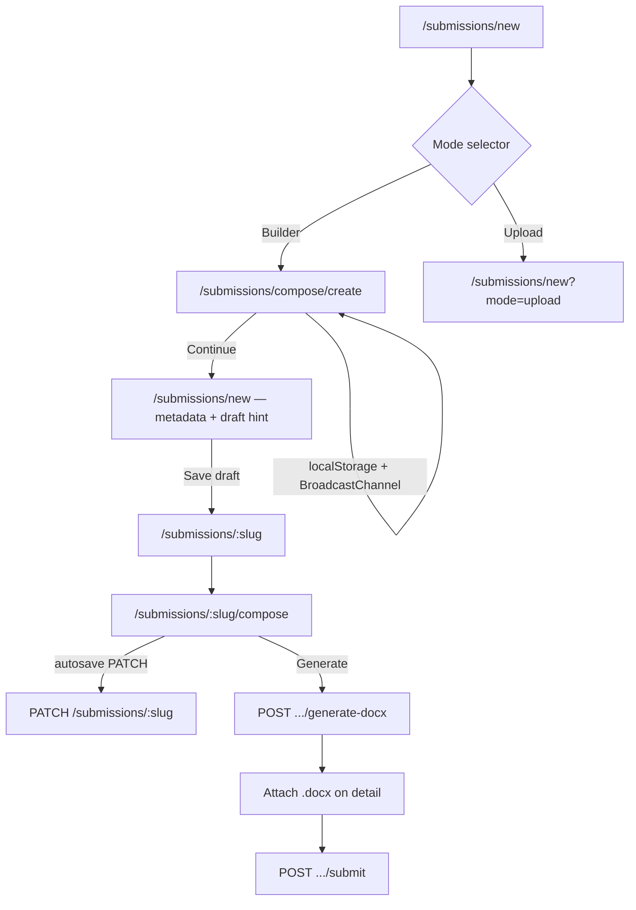

# Word Constructor — design record

In-app manuscript builder for authors who do not have a finished `.docx`. Structured content is stored as JSON (`constructor_content`), edited in the browser, previewed live, and exported to a styled Word file via the Nest API.

Operator overview and run commands: [README — Word Constructor](../../README.md#word-constructor-in-app-document-builder).

## Problem and scope

Many authors arrive without a journal-ready Word file. Upload-only submission flows block them or force offline editing. The constructor:

- Guides mandatory bilingual metadata (titles, abstracts, references).
- Supports IMRaD-style body structure via presets.
- Produces a `.docx` that matches curated **manuscript styles** (see [`docs/styles/`](../styles/)).
- Reuses the same **submit for review** path as upload mode once a generated file is attached.

**Out of scope (by design):**

- Reverse-engineering an uploaded `.docx` into editable constructor sections (import is merge-into-draft only, with warnings).
- Editable OMML equations in Word (equations are PNG images).
- Real-time multi-user collaboration (same-browser multi-tab sync only).

## Data model

| Field | Storage | Meaning |
|-------|---------|---------|
| `submissions.constructor_content` | JSONB, nullable | `ConstructorContent` document; non-null means the submission has constructor content committed on the server |
| `submissions.review_manuscript_presentation` | JSONB, nullable | Which sources (upload / constructor `.docx`) are included in the review package at submit |

Types are defined in:

- [`backend/src/submissions/constructor-content.types.ts`](../../backend/src/submissions/constructor-content.types.ts) (source of truth)
- [`frontend/src/lib/constructor-content.types.ts`](../../frontend/src/lib/constructor-content.types.ts) (mirror — keep in sync)

`ConstructorContent` contains `defaultDir`, optional `manuscriptStyleId`, and an ordered `sections[]`. Each section has a stable `id`, `kind`, and kind-specific fields. Figure/table **numbers are not stored**; they are derived at render time by walking the section list.

### Section kinds (v2)

| Kind | Role |
|------|------|
| `title` | Bilingual titles (`lang`: `en` \| `ar`) |
| `authors` | Author list with affiliation metadata |
| `abstract` | Bilingual abstracts + keywords; direction from `lang` |
| `heading1` / `heading2` / `heading3` | IMRaD / body headings |
| `paragraph` | TipTap HTML (sanitized subset) |
| `image` | Figure + caption; file id reference |
| `table` | Grid + optional header row + caption + **notes** |
| `references` | Bibliography items |
| `acknowledgments`, `funding`, `conflictOfInterest`, `dataAvailability` | Back-matter rich-text blocks |
| `equation` | LaTeX source; optional `numbered` |

IMRaD presets set `presetSourceId` (`introduction`, `literatureReview`, `materialsAndMethods`, `resultsAndDiscussion`, `conclusions`) for profile recommendations. Preset bundles live in [`frontend/src/lib/constructor-section-presets.ts`](../../frontend/src/lib/constructor-section-presets.ts).

### Validation

Shared error shape: `{ code, message, sectionId? }[]`.

- Backend: [`constructor-content-utils.ts`](../../backend/src/submissions/constructor-content-utils.ts)
- Frontend: [`constructor-validation.ts`](../../frontend/src/lib/constructor-validation.ts)

Submit and generate-docx both run validation; the UI shows a banner with jump-to-section for structured errors.

## User flows

**Pre-slug compose** (`/submissions/compose/create`): draft in `localStorage` key `folio.constructor-draft.v1`, synced across tabs via `BroadcastChannel`. Legacy `/submissions/constructor/*` redirects to `/submissions/compose/*`.

**Post-slug compose** (`/submissions/[slug]/compose`): autosave every ~1.5 s to `constructor_content`; generates `.docx` on demand.

**Upload vs constructor on one submission:** After a server record exists, authors may have both an uploaded manuscript and constructor content. The detail page exposes a **review manuscript presentation** picker (which sources editors/reviewers see). Switching away from constructor-only mode is gated behind explicit cleanup — see UI copy on submission detail.

Reviewers never receive `constructor_content` in API responses ([`docs/DATA-MODEL.md`](../DATA-MODEL.md)).

## Direction and bilingual text

### Implementation Note 1 — Arabic RTL detection

Heuristic in [`frontend/src/lib/constructor-direction.ts`](../../frontend/src/lib/constructor-direction.ts):

- Count letter characters (`\p{L}`) vs Arabic Unicode blocks.
- If Arabic ratio **> 0.30** (`ARABIC_THRESHOLD`), classify as `rtl`.
- Threshold is intentionally permissive so Arabic prose with English citations stays RTL.
- Tune `ARABIC_THRESHOLD` if real articles misfire; document changes here.

Section direction resolution:

1. `abstract`: `lang === 'ar'` ⇒ `rtl`, else `ltr`.
2. Else: explicit `section.dir` if set (manual override).
3. Else: `content.defaultDir`.

Auto-detected sections set `dirSource: 'auto'`; toolbar overrides set `manual`.

### Page-count badge

Weighted estimate: `words + 150×images + 80×tableRows`. Soft warning above ~7,500 weighted words (~25 pages, Damascus guideline). Same module as direction helpers.

## Rich text and HTML safety

Paragraph and back-matter fields store TipTap HTML. Allowed tags are a small subset (`p`, `strong`, `em`, `u`, lists, `br`). Sanitization:

- Frontend editor output: [`frontend/src/lib/sanitize-constructor-html.ts`](../../frontend/src/lib/sanitize-constructor-html.ts)
- Backend before DOCX / persistence: [`backend/src/submissions/sanitize-constructor-html.ts`](../../backend/src/submissions/sanitize-constructor-html.ts)

**No inline images in paragraphs** — TipTap image extension is disabled; use `image` sections so `localStorage` stays small.

## `.docx` generation

[`DocxGeneratorService`](../../backend/src/submissions/docx-generator.service.ts) walks sections and builds a `docx` package. Style tokens come from [`backend/src/manuscript-styles`](../../backend/src/manuscript-styles) (`manuscriptStyleId` on content, default profile when absent — see [`docs/styles/README.md`](../styles/README.md)).

**Docx import (compose):** Heuristic heading/paragraph mapping from uploaded `.docx` into sections; stable warning codes when attribution is uncertain ([`constructor-import-warning-codes.ts`](../../frontend/src/lib/constructor-import-warning-codes.ts)).

**File references:** `collectReferencedFileIds` in constructor-content-utils ensures orphan uploads are not deleted while still referenced.

API:

- `PATCH /api/v1/submissions/:slug` — body may include `constructorContent`
- `POST /api/v1/submissions/:slug/generate-docx` — optional inline `content` in body (used when client has unsaved editor state); returns OOXML or attaches file

## Equations

LaTeX in the UI is previewed with **KaTeX** (frontend). Backend [`EquationRenderService`](../../backend/src/submissions/equation-render.service.ts):

1. Prefer **Playwright** screenshot of KaTeX HTML → PNG (Edge/Chrome on Windows, bundled Chromium elsewhere).
2. Fallback: MathJax + `sharp` when Playwright is unavailable.

Word receives **embedded images**, not OMML. Local dev: `npx playwright install chromium` in `backend/` on non-Windows hosts if needed.

## Frontend modules

| Area | Path |
|------|------|
| Workspace shell | [`ConstructorWorkspace.tsx`](../../frontend/src/components/constructor/ConstructorWorkspace.tsx) |
| Section editors / preview | [`SectionEditors.tsx`](../../frontend/src/components/constructor/SectionEditors.tsx), [`LivePreview.tsx`](../../frontend/src/components/constructor/LivePreview.tsx) |
| List / validation | [`SectionList.tsx`](../../frontend/src/components/constructor/SectionList.tsx), [`ValidationBanner.tsx`](../../frontend/src/components/constructor/ValidationBanner.tsx) |
| Mode entry | [`ModeSelector.tsx`](../../frontend/src/components/constructor/ModeSelector.tsx) |
| Draft hooks | [`use-constructor-draft.ts`](../../frontend/src/lib/use-constructor-draft.ts) |

i18n: `ConstructorList.*`, `ConstructorEditor.*` in `frontend/messages/en.json` and `ar.json`.

## Deliberate limitations (v1 / deferred)

| Topic | Status |
|-------|--------|
| Footnotes / endnotes | Deferred (v2) |
| Merged table cells (`rowspan`/`colspan`) | Flat grids only in v1 |
| Bidirectional marks inside one paragraph | Per-section direction only |
| Live multi-device editing | Last-write-wins on autosave |
| Constructor ↔ upload round-trip | No full structural import of arbitrary uploads |

## Extending the constructor

When adding a section kind:

1. Extend `ConstructorSectionKind` in **both** type files.
2. Update union + `createBlankSection` in `SectionEditors.tsx`.
3. Add editor + `LivePreview` branches.
4. Add `build*` in `DocxGeneratorService` and register in dispatcher.
5. Extend `collectReferencedFileIds` if the kind references files.
6. Add validation rules on backend + frontend.
7. Add translation keys in `en.json` / `ar.json`.

## Related docs

- [Damascus journal style v1](../styles/damascus-university-journal-v1.md)
- [API notes — submissions / redaction](../API-NOTES.md)
- [Playwright constructor E2E](./playwright-constructor-e2e.md)
