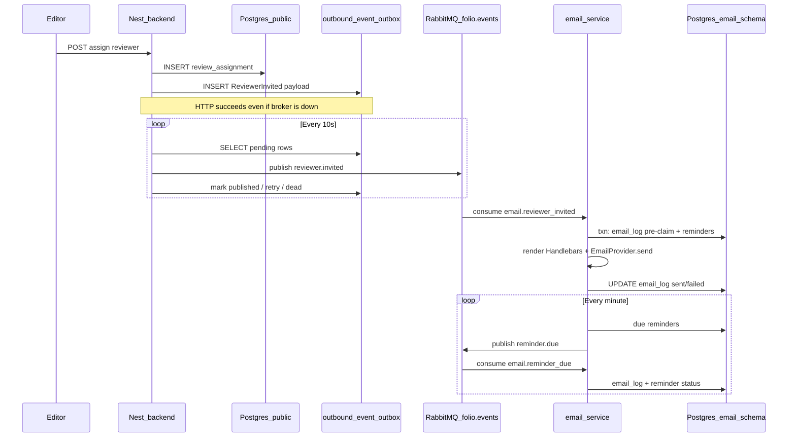

Here’s a structured walkthrough of how the feature works end-to-end, aligned with what’s actually in the repo.

## 1. What problem this solves

Editors assign reviewers via the existing API. You wanted:

- **Immediate email** when an assignment is created (invite + accept/decline links).
- **Scheduled reminders** (e.g. “due soon” / “overdue”) without blocking HTTP requests or baking SMTP into the main API.
- **One place** that sends mail and owns retries/dedupe for email, while the core API stays focused on peer-review data.

So the design is **hybrid**: the Nest **backend never sends mail**. It only records facts in Postgres and puts **events** on RabbitMQ. The **`services/email-service`** is the only process that renders templates and talks to an email provider (Noop in dev, SMTP skeleton for later).

---

## 2. Big picture data flow

---

## 3. Backend: assignment → outbox → RabbitMQ

### 3.1 When it fires

When `assignReviewer` in [`submissions.service.ts`](backend/src/submissions/submissions.service.ts) successfully **`save`s** a `ReviewAssignment`, it builds a **`ReviewerInvitedEvent`** and calls the **event publisher** to **enqueue** it—not to RabbitMQ directly.

That event includes:

- **`idempotencyKey`**: `reviewer_invited:<assignmentSlug>` (unique per assignment row).
- **Reviewer** identity (id, email, display name).
- **Invited-by** editor (loaded from DB because JWT user doesn’t carry display name).
- **`acceptUrl` / `declineUrl`**: built from **`APP_BASE_URL`** (no trailing slash), e.g.  
  `{APP_BASE_URL}/assignments/{assignmentSlug}/accept` and `/decline`.

So the **HTTP contract** of `POST /submissions/:slug/assignments` is unchanged; only behavior behind it grows.

**Enqueue skips (no outbox row):** If **`assignment.slug`** or **`submission.slug`** is missing, or the **editor** row cannot be loaded from the DB, the backend logs a **warn** and **does not enqueue** `reviewer.invited` — the assignment row still persists. Failures inside `enqueueReviewerInvitedEvent` are caught and logged (**warn**); they do **not** roll back the assignment.

### 3.2 Transactional outbox (`outbound_event_outbox`)

Rows live in the **`public`** schema with the rest of the backend data. Each row has:

- `routingKey` (e.g. `reviewer.invited`)
- `payload` (JSON)
- `status`: `pending` → `published`, or **`dead`** after max retries
- `attempts`, `nextAttemptAt`, `lastError`

**Why:** If RabbitMQ is down, the assignment still commits; the outbox row guarantees **eventual** publish when the broker returns.

### 3.3 Outbox drainer

A scheduled task (**every 10 seconds**) in [`outbox-drainer.service.ts`](backend/src/messaging/outbox-drainer.service.ts):

- Picks **pending** rows whose **`nextAttemptAt`** is due (or null).
- Calls **`RabbitMqConnection.publish(exchange, routingKey, json)`** against topic exchange **`folio.events`**.
- On success: marks **`published`** with **`publishedAt`**.
- On failure: increments **`attempts`**, sets **exponential backoff** (capped), and after **8 attempts** marks **`dead`** (no infinite retry).

### 3.4 Topology on the publisher

On first connect, the backend runs **`assertTopology()`** (same helper mirrored in both apps): declares **`folio.events`** (topic), **DLX**, **queues**, **bindings**, **DLQ**. So backend and email-service don’t drift.

### 3.5 Ops endpoint

`GET /api/v1/health/outbox` exposes **counts** (pending / dead / published, oldest pending metadata)—**no PII**, useful for “broker stuck / drainer broken” alerts.

---

## 4. RabbitMQ: routing and queues

From [`topology`](backend/src/messaging/shared/topology.ts) / [`packages/shared/messaging/topology.ts`](packages/shared/messaging/topology.ts):

| Piece | Name |
|--------|------|
| Main exchange | `folio.events` (topic, durable) |
| DLX | `folio.events.dlx` |
| DLQ | `folio.events.dlq` (bound to DLX with `#`) |
| Queue 1 | `email.reviewer_invited` ← binding **`reviewer.invited`** |
| Queue 2 | `email.reminder_due` ← binding **`reminder.due`** |

Messages are **JSON** bodies matching the shared **event types** in [`packages/shared/contracts/email-events.ts`](packages/shared/contracts/email-events.ts) (mirrored under each app’s `messaging/contracts`).

---

## 5. Email service: process model

**Not** a second HTTP API for this feature. [`main.ts`](services/email-service/src/main.ts) boots a **`NestFactory.createApplicationContext`** (no HTTP server): migration run + RabbitMQ consumer + cron.

- **Same Postgres server** as the backend, but TypeORM is pinned to schema **`email`** ([`data-source.ts`](services/email-service/src/db/data-source.ts)).
- **Migrations** create **`email.email_log`** and **`email.reminder`** ([`1714600000000-init.ts`](services/email-service/src/db/migrations/1714600000000-init.ts)); startup also runs **`runMigrations()`** so a fresh DB works without a manual step.

---

## 6. Consumer: `reviewer.invited` — state machine (the important part)

Implemented in [`reviewer-invited.handler.ts`](services/email-service/src/handlers/reviewer-invited.handler.ts), coordinated by [`consumers.service.ts`](services/email-service/src/handlers/consumers.service.ts).

### 6.1 Pre-claim + reminders in one transaction

Inside a DB transaction:

1. **`INSERT INTO email_log … ON CONFLICT (idempotency_key) DO NOTHING RETURNING id`**  
   - **One row returned** → first time processing this message → continue.  
   - **Zero rows** → conflict → load existing row by `idempotency_key` and branch on **`status`** (see below).

2. If this was the **first insert**, insert **two `Reminder` rows**:
   - `review_due_soon` at roughly **`now + (REVIEW_DUE_IN_DAYS − 3)` days**
   - `review_overdue` at roughly **`now + (REVIEW_DUE_IN_DAYS + 1)` days**  
   (exact math is in code; driven by **`REVIEW_DUE_IN_DAYS`**.)

**Clamp:** If **`REVIEW_DUE_IN_DAYS`** is missing, non-finite, or **≤ 3**, the email-service falls back to **21** days for computing offsets (`dueSoonMs` / `overdueMs`). Test edge values accordingly.

3. **Commit** the transaction.

So **reminder scheduling** is owned **only** by the email-service; the backend doesn’t know cadence.

### 6.2 After commit: send outside the transaction

4. **Render** Handlebars ([`templates/`](services/email-service/templates)) via [`templates.service.ts`](services/email-service/src/templates/templates.service.ts).
5. Call **`EmailProvider.send`** ([`providers/`](services/email-service/src/providers)): default **`noop`** logs the send; **`smtp`** uses Nodemailer when configured.

6. **Success**: `UPDATE email_log SET status='sent', … WHERE id=? AND status IN ('pending','failed')`  
   The **`IN ('pending','failed')`** guard avoids two workers both marking **sent** for the same logical send.

7. **Failure**: `UPDATE email_log SET status='failed', error=…`, then the AMQP layer **nacks without requeue** so the message can **dead-letter** per broker rules; redelivery logic relies on the **`failed`** branch next time.

### 6.3 Why “0 inserts” is not always “duplicate OK”

If the insert conflicts (**0 rows**), the handler **loads** the row:

- **`pending`** → transaction committed but send never finished (crash) → **resume send** only (don’t insert reminders again).
- **`failed`** → retry provider path.
- **`sent`** → true duplicate → **ack** and done.

That matches the plan’s review feedback: avoid losing sends when the worker dies between commit and SMTP.

### 6.4 PII in logs

[`redactor.ts`](services/email-service/src/shared/redactor.ts) strips **`reviewer`** / **`invitedBy`** (and similar) before **`Logger`** calls so logs don’t contain emails/names.

---

## 7. Reminders: cron → `reminder.due` → same handler style

### 7.1 Scheduler

[`reminders.scheduler.ts`](services/email-service/src/reminders/reminders.scheduler.ts) runs **every minute**, loads **`Reminder`** rows with **`status = pending`** and **`sendAt <= now()`**, and **publishes** a **`ReminderDueEvent`** to **`reminder.due`** on the **same** `folio.events` exchange.

**Why republish to Rabbit instead of sending inline?** One code path for template + provider + failure semantics (as in the plan).

### 7.2 `reminder.due` handler

[`reminder-due.handler.ts`](services/email-service/src/handlers/reminder-due.handler.ts):

- Verifies **`Reminder`** still exists and is **`pending`** (stale work dropped).
- Same **`email_log` pre-claim** pattern with idempotency **`reminder_due:<reminderId>`**.
- Renders **`reminder-due`** templates.

**Caveat in current code:** the template still uses a **placeholder** submission title (`"[manuscript]"`) unless you extend **`ReminderDueEvent`** / scheduler to pass **`submissionTitle`** from the backend or a cached field—that’s an obvious follow-up if you want parity with the invite email.

---

## 8. Contracts (single source of truth pattern)

Canonical definitions: [`packages/shared/contracts/email-events.ts`](packages/shared/contracts/email-events.ts).  
_(The file header still mentions “path mapping”; in practice each Nest app compiles **byte-identical mirrors** — see below.)_

Each deployed app also keeps **byte-identical mirrors** under:

- `backend/src/messaging/contracts/`
- `services/email-service/src/contracts/`

Reason (from implementation notes): Nest **`tsc`** roots at each app’s `src/`; importing `packages/shared` as real TS without a monorepo bundler would complicate `dist/` layout. The README already uses “mirror” for constructor types; same idea here.

---

## 9. Configuration you actually need

**Backend** ([`backend/.env.example`](backend/.env.example)):

- **`RABBITMQ_URL`**, **`RABBITMQ_EXCHANGE`** (default `folio.events`)
- **`APP_BASE_URL`** for invite links — if unset, code defaults to **`http://localhost:5240`** (no trailing slash in stored URLs; trailing slashes are stripped when building links).

**Email service** ([`services/email-service/.env.example`](services/email-service/.env.example)):

- Same **`DB_*`** database name as backend, **`DB_SCHEMA=email`**
- Same RabbitMQ settings
- **`EMAIL_PROVIDER`** (`noop` | `smtp`), **`EMAIL_FROM`**, optional **`SMTP_*`**
- **`REVIEW_DUE_IN_DAYS`**, **`APP_BASE_URL`** (for reminder links in templates; same **default `http://localhost:5240`** if unset)

**Infra:** [`docker-compose.dev.yml`](docker-compose.dev.yml) runs **RabbitMQ 3 management** on **5672 / 15672**.

---

## 10. Documentation that describes this

- Full design narrative: [`docs/plans/email-service.md`](docs/plans/email-service.md)
- API / Phase 2 / eventing table: [`docs/API-NOTES.md`](docs/API-NOTES.md)
- Automated / manual test commands and full-stack smoke steps: [`docs/testing-email-pipeline.md`](docs/testing-email-pipeline.md)

---

## 11. Plan vs implementation (short honesty list)

- Plan mentioned **`@nestjs/microservices`**; implementation uses **`amqplib`** directly with a thin Nest wrapper so topic exchange + DLX match the spec without fighting Nest’s default RMQ patterns.
- Plan said **`reminder.due` would re-check assignment via backend HTTP** before send; the **current** v1 shortcut is “**Reminder still pending**” in DB (no extra API call yet).

---

If you want this explained **against your running `.env`** (URLs, ports, which processes you must start), say what you run today (Docker yes/no, DB host) and we can map it to your machine step by step.